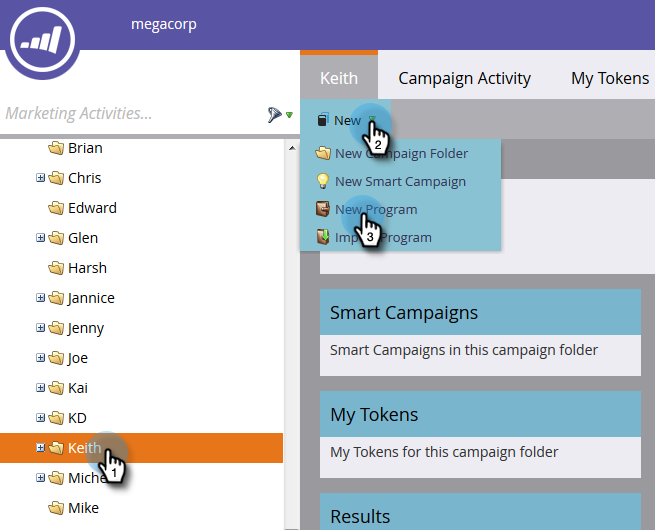

# Creación de un programa de correo electrónico {#create-an-email-program}

Utilice programas de correo electrónico para enviar un correo electrónico rápida y fácilmente a un grupo de personas.

1. Vaya a **[!UICONTROL Actividades de marketing]**.

   

1. Seleccione la carpeta en la que desea crear el programa, haga clic en la lista desplegable **[!UICONTROL Nuevo]** y seleccione **[!UICONTROL Nuevo programa]**.

   

1. Escriba un nombre, seleccione **[!UICONTROL Correo electrónico]** como [!UICONTROL Tipo de programa] y haga clic en **[!UICONTROL Crear]**.

   

   >[!NOTE]
   >
   >Al seleccionar **[!UICONTROL Correo electrónico]** como Tipo de programa, el canal se establecerá automáticamente en **[!UICONTROL Envío de correo electrónico]**. Puede cambiarlo si lo desea.

   

¡Bonito! Observe que el programa está ahora en el árbol y listo para utilizarse. El siguiente paso será definir la audiencia. Consulte los Artículos relacionados de Marketo a continuación.

>[!MORELIKETHIS]
>
>* [Definir una audiencia con una lista inteligente](/help/marketo/product-docs/email-marketing/email-programs/managing-people-in-email-programs/define-an-audience-with-a-smart-list.md)
>* [Definir una audiencia importando una lista](/help/marketo/product-docs/email-marketing/email-programs/managing-people-in-email-programs/define-an-audience-by-importing-a-list.md)
