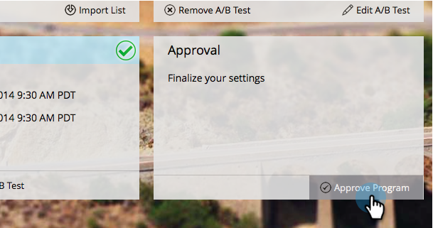
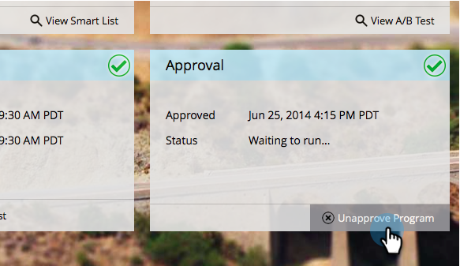

# Aprobar/Desaprobar un programa de correo electrónico {#approve-unapprove-an-email-program}

>[!PREREQUISITES]
>
>* [Crear un programa de correo electrónico](/help/marketo/product-docs/email-marketing/email-programs/creating-an-email-program/create-an-email-program.md)
>* [Definir una audiencia con una lista inteligente](/help/marketo/product-docs/email-marketing/email-programs/managing-people-in-email-programs/define-an-audience-with-a-smart-list.md) o [Definir una audiencia mediante la importación de una lista](/help/marketo/product-docs/email-marketing/email-programs/managing-people-in-email-programs/define-an-audience-by-importing-a-list.md)
>
>* [Elegir un correo electrónico existente](/help/marketo/product-docs/email-marketing/email-programs/email-program-actions/choose-an-existing-email.md) o [Creación de un correo electrónico para un programa de correo electrónico](/help/marketo/product-docs/email-marketing/email-programs/email-program-actions/create-an-email-for-an-email-program.md)
>
>* [Programar su programa de correo electrónico](/help/marketo/product-docs/email-marketing/email-programs/email-program-actions/schedule-your-email-program.md)

## Aprobar el programa de correo electrónico {#approve-your-email-program}

Ahora que el programa está listo para ejecutarse, el paso final es aprobarlo. Así es como:

1. Vaya a **Actividades de marketing**.

   

   Seleccione su programa de correo electrónico.
   

   >[!CAUTION]
   >
   >Si no aprueba su programa de correo electrónico, el correo electrónico no se publicará.

1. En el **Aprobación** mosaico continúe y haga clic en **Aprobar programa**.

   

1. Si encontramos problemas, le avisaremos: corríjelos e intente aprobarlos de nuevo.

   

   ¡Perfecto! Ya has terminado. Su correo electrónico se publicará a la hora programada.

   

## Desaprobar el programa de correo electrónico {#unapprove-your-email-program}

Si cambia de opinión y decide que no quiere que salga, puede desaprobar el programa de correo electrónico.

1. Vaya a **Actividades de marketing**.

   

1. Seleccione su programa de correo electrónico.

   

1. En el **Aprobación** mosaico, simplemente haga clic en **Desaprobar programa**.

   

¡Listo y listo! El correo electrónico no se enviará hasta que lo apruebe de nuevo.
