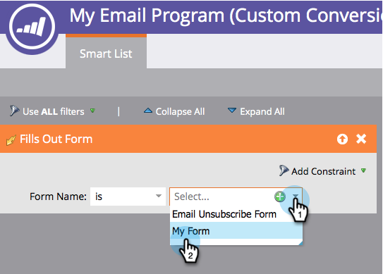

# Definir los criterios de ganador de la prueba A/B {#define-the-a-b-test-winner-criteria}

Cuándo [adición de una prueba A/B](/help/marketo/product-docs/email-marketing/email-programs/email-program-actions/email-test-a-b-test/add-an-a-b-test.md){target="_blank"} to your email program, you will need to pick a test type, [schedule the A/B test](/help/marketo/product-docs/email-marketing/email-programs/email-program-actions/email-test-a-b-test/schedule-the-a-b-test.md){target="_blank"}y, a continuación, defina los criterios de ganador. Así se decide qué correo electrónico gana.

>[!PREREQUISITES]
>
>[Añadir una prueba A/B](/help/marketo/product-docs/email-marketing/email-programs/email-program-actions/email-test-a-b-test/add-an-a-b-test.md){target="_blank"}

## Criterios de ganadores {#winner-criteria}

1. El valor predeterminado **Criterios del ganador** Las opciones de se muestran primero.

   

   <table>
   <tr>
   <td><b>Abre</b></td>
   <td>Una apertura registra cuándo se descargan las imágenes en un correo electrónico. Aunque no incluya una imagen, Marketo inserta de forma predeterminada un solo píxel de seguimiento en todos los correos electrónicos del HTML.</td>
   </tr>
   <tr>
   <td><b>Clics</b></td>
   <td>De forma predeterminada, los vínculos de los correos electrónicos tienen un seguimiento incrustado que le permite ver quién hizo clic en qué vínculo, en cuántos vínculos se hizo clic, etc.</td>
   </tr>
   <tr>
   <td><b>Hace clic para abrir %</b></td>
   <td>Porcentaje de correos electrónicos que se abrieron y en los que se hizo clic en un vínculo. Esto mide la relevancia y el contexto de un correo electrónico tomando el número de clics únicos dividido por el número de aperturas únicas y luego multiplicándolo por 100 para mostrarlo como un porcentaje.</td>
   </tr>
   <tr>
   <td><b>Puntaje de participación</b></td>
   <td>El <a href="https://experienceleague.adobe.com/docs/marketo/using/product-docs/email-marketing/drip-nurturing/reports-and-notifications/understanding-the-engagement-score.html" target="_blank">puntuación de participación</a> le ayuda a determinar la eficacia del contenido.</td>
   </tr>
   </table>

   >[!TIP]
   >
   >Si elige Puntuación de participación, la prueba deberá ejecutarse durante al menos 24 horas. Más información sobre [explicación de la puntuación de participación](/help/marketo/product-docs/email-marketing/drip-nurturing/reports-and-notifications/understanding-the-engagement-score.md){target="_blank"}.

1. También puede personalizar los criterios seleccionando Conversión personalizada y haciendo clic en Editar.

   

   >[!NOTE]
   >
   >La conversión personalizada permite elegir cualquier evento como conversión mediante déclencheur y filtros.

1. Se abrirá una ventana. Busque el déclencheur que desee y arrástrelo al lienzo.

   

1. Defina el déclencheur.

   

   >[!IMPORTANT]
   >
   >Marketo solo permite déclencheur para las personas que han recibido el correo electrónico desde este programa de correo electrónico, por lo que no es necesario añadir el filtro &quot;Se envió el correo electrónico&quot;. Además, cuando utilice un déclencheur relacionado con el correo electrónico, asegúrese de utilizar &quot;is any&quot; como operador.

1. Haga clic en **Cerrar**.

   

   Excelente! Ahora es el momento de decidir cómo se determina el ganador.

## Proclamar al ganador {#declare-winner}

1. Elija una de las dos opciones disponibles.

   

   >[!NOTE]
   >
   >Si está haciendo una **Fecha/hora** Prueba A/B, solo puede elegir **Manual**.

   Una vez finalizada la prueba A/B, Marketo puede enviar automáticamente el correo electrónico ganador a la hora programada o puede revisar los resultados y decidir qué correo electrónico se envía cuando.

1. Automático es impresionante y es la opción predeterminada. Solo haga clic en **Siguiente**.

   

   >[!TIP]
   >
   >Elección **Manual** enviará la prueba y esperará a que declare un ganador. Recibirá un informe de los resultados.

¡Perfecto! Ahora vamos a... [programe la prueba A/B](/help/marketo/product-docs/email-marketing/email-programs/email-program-actions/email-test-a-b-test/schedule-the-a-b-test.md){target="_blank"}.
