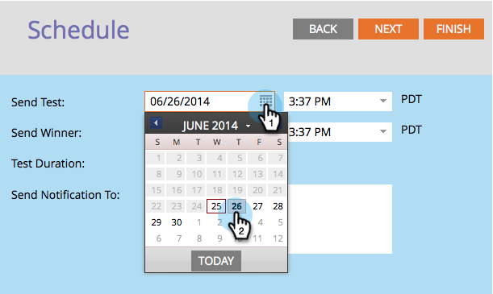

# Programe la prueba A/B {#schedule-the-a-b-test}

Una vez que haya agregado una prueba A/B a un programa de correo electrónico y haya definido los criterios de ganador que deberá programar cuando comience la prueba. Así es como.

>[!PREREQUISITES]
>
>[Agregar una prueba A/B](/help/marketo/product-docs/email-marketing/email-programs/email-program-actions/email-test-a-b-test/add-an-a-b-test.md)

>[!NOTE]
>
>Para las pruebas de fecha y hora, solo debe configurar cuando reciba el resumen de los resultados de la prueba.

1. Seleccione la fecha **[!UICONTROL Enviar prueba]**.

1. Seleccione la hora **[!UICONTROL Enviar prueba]**.

   

   >[!NOTE]
   >
   >Enviar prueba y Enviar ganador deben estar separados por lo menos 4 horas. Sin embargo, para envíos más grandes, es posible que desee esperar 24 horas para permitir tiempo suficiente para obtener buenos resultados.

1. Haz lo mismo con **[!UICONTROL Enviar ganador]**. Escriba los destinatarios de la notificación (opcional) y haga clic en **[!UICONTROL Siguiente]**.

   >[!NOTE]
   >
   >Solo el grupo de prueba recibirá las variantes de prueba.

   

   >[!NOTE]
   >
   >Si decide declarar un ganador manualmente, definirá la fecha y hora del **envío del informe** en lugar del **envío por correo de fin**.

   ¡Súper! Terminaste, revisa el resumen y haz clic en **[!UICONTROL Cerrar]**.

   

   Observará que el mosaico **[!UICONTROL Programar]** se ha actualizado.

   

   >[!NOTE]
   >
   >Al programar una prueba A/B también se configura la fecha de envío final o la fecha de envío del informe.

   Si ya ha definido la audiencia y ha elegido un correo electrónico, el único paso que queda es aprobar el programa.

   >[!MORELIKETHIS]
   >
   >[Aprobar o desaprobar un programa de correo electrónico](/help/marketo/product-docs/email-marketing/email-programs/email-program-actions/approve-unapprove-an-email-program.md)
