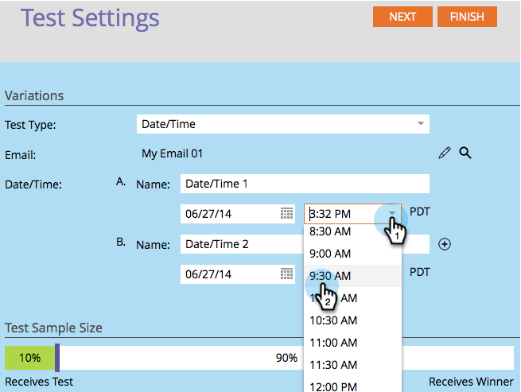

# Usar la prueba A/B &quot;Fecha/Hora&quot; {#use-date-time-a-b-testing}

Puede probar fácilmente los correos electrónicos A/B. Una prueba es la **Fecha y hora** prueba. Esto prueba a qué hora del día o del día de la semana es mejor enviar correos electrónicos. Así es como configurarlo.

>[!PREREQUISITES]
>
>[Agregar una prueba A/B](/help/marketo/product-docs/email-marketing/email-programs/email-program-actions/email-test-a-b-test/add-an-a-b-test.md)

1. En el **Correo electrónico** mosaico, haga clic en **Agregar prueba A/B**.

   

1. Se abre una nueva ventana. Select **Fecha y hora** para **Tipo de prueba**.

   

1. Si tiene información de prueba anterior (como una prueba de sujeto), puede hacer clic en **Restablecer prueba**.

   

1. Seleccione la fecha de la primera fecha/hora.

   

1. Seleccione la hora de la primera fecha/hora.

   

1. Haga lo mismo para su segunda fecha/hora.

   

1. Utilice el control deslizante para elegir el porcentaje de audiencia que desea en la prueba A/B y haga clic en **Siguiente**.

   

   >[!NOTE]
   >
   >Las diferentes variaciones se aplicarán a partes iguales del tamaño de muestra de prueba elegido.

   >[!CAUTION]
   >
   >**Le recomendamos que evite establecer el tamaño de la muestra en 100%**. Si utiliza una lista estática, si establece el tamaño de la muestra en 100 %, el correo electrónico se envía a todos los miembros de la audiencia y el ganador no va a nadie. Si está utilizando un **smart** , si establece el tamaño de la muestra en 100 %, el correo electrónico se envía a todos los miembros de la audiencia _en ese momento_. Cuando el programa de correo electrónico se ejecute de nuevo en una fecha posterior, cualquier persona nueva que cumpla los requisitos para la lista inteligente también recibirá el correo electrónico, ya que ahora está incluido en la audiencia.

   Bueno, estamos un paso más cerca. Ahora necesitamos [definir los criterios del ganador de la prueba A/B](/help/marketo/product-docs/email-marketing/email-programs/email-program-actions/email-test-a-b-test/define-the-a-b-test-winner-criteria.md).
