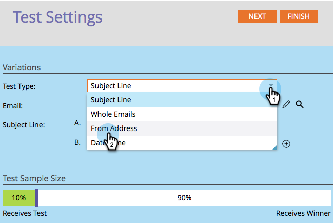
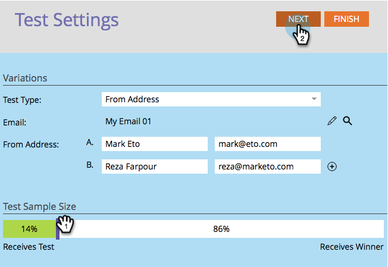

# Usar Prueba A/B &quot;[!UICONTROL Dirección De Origen]&quot; {#use-from-address-a-b-testing}

Puede probar fácilmente sus correos electrónicos A/B. Una prueba interesante es la prueba **[!UICONTROL Dirección de origen]**. A continuación se muestra cómo configurarlo.

>[!PREREQUISITES]
>
>[Agregar una prueba A/B](/help/marketo/product-docs/email-marketing/email-programs/email-program-actions/email-test-a-b-test/add-an-a-b-test.md)

1. En el mosaico **[!UICONTROL Correo electrónico]**, con el correo electrónico seleccionado, haga clic en **[!UICONTROL Agregar prueba A/B]**.

   

1. Se abre una nueva ventana, seleccione **[!UICONTROL Dirección desde]** para **[!UICONTROL Tipo de prueba]**.

   

1. Si tiene información de prueba anterior (como una prueba de sujeto), puede hacer clic con seguridad en **[!UICONTROL Restablecer prueba]**.

   

1. Escriba la segunda información **[!UICONTROL de la dirección]** que desee probar.

   >[!NOTE]
   >
   >La opción A se rellenará previamente con la información contenida en el correo electrónico seleccionado.

   

   >[!TIP]
   >
   >Puede hacer clic en **+** para agregar todas las direcciones remitente que desee.

1. Utilice el control deslizante para elegir el porcentaje de audiencia que desea en la prueba A/B y haga clic en **[!UICONTROL Siguiente]**.

   

   >[!NOTE]
   >
   >Las diferentes variaciones enviarán partes iguales del tamaño de muestra de prueba elegido.

   >[!CAUTION]
   >
   >**Le recomendamos que evite establecer el tamaño de la muestra en 100%**. Si utiliza una lista estática, al establecer el tamaño de la muestra en 100 % se envía el correo electrónico a todos los miembros de la audiencia y el ganador se lo lleva a nadie. Si usa una lista **inteligente**, al establecer el tamaño de la muestra en 100% se enviará el correo electrónico a todos los miembros de la audiencia _en ese momento_. Cuando el programa de correo electrónico se vuelva a ejecutar más adelante, cualquier nueva persona que cumpla los requisitos para la lista inteligente también recibirá el correo electrónico, ya que ahora se incluye en la audiencia.

   Bien, ya casi llegamos. Ahora necesitamos [definir los criterios de ganador de la prueba A/B](/help/marketo/product-docs/email-marketing/email-programs/email-program-actions/email-test-a-b-test/define-the-a-b-test-winner-criteria.md).
