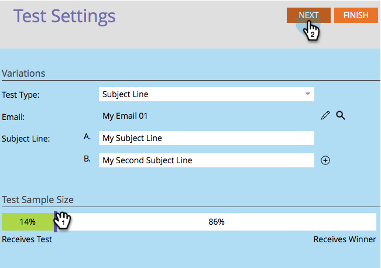

# Usar prueba A/B de &quot;Línea de asunto&quot; {#use-subject-line-a-b-testing}

Puede probar fácilmente los correos electrónicos A/B. Una de las pruebas más comunes es la **Línea de asunto** prueba.

>[!PREREQUISITES]
>
>[Agregar una prueba A/B](/help/marketo/product-docs/email-marketing/email-programs/email-program-actions/email-test-a-b-test/add-an-a-b-test.md)

1. En el mosaico Correo electrónico , con el correo electrónico seleccionado, haga clic en Agregar prueba A/B.

1. Se abrirá la ventana del editor de pruebas. Introduzca una o más líneas de asunto nuevas.

   >[!NOTE]
   >
   >Opción **A** se rellenará previamente con la información contenida en el correo electrónico seleccionado.

   

   >[!TIP]
   >
   >Puede hacer clic en la **+** para añadir más líneas de asunto.

1. Utilice el control deslizante para elegir el porcentaje de audiencia que desea que reciba la prueba A/B y haga clic en **Siguiente**.

   

   >[!CAUTION]
   >
   >**Le recomendamos que evite establecer el tamaño de la muestra en 100%**. Si utiliza una lista estática, si establece el tamaño de la muestra en 100 %, se enviará el correo electrónico a todos los miembros de la audiencia y el ganador no pasará a nadie. Si utiliza una lista inteligente, si establece el tamaño de la muestra en 100 %, el correo electrónico se enviará a todos los miembros de la audiencia _en ese momento_. Y cuando el programa de correo electrónico se ejecute de nuevo en una fecha posterior, cualquier persona nueva que cumpla los requisitos para la lista inteligente también recibirá el correo electrónico, ya que ahora está incluido en la audiencia.

   >[!NOTE]
   >
   >Las diferentes variaciones de asunto tomarán partes iguales del tamaño de muestra de prueba seleccionado.

   Bueno, casi estamos ahí. Ahora necesitamos [definir los criterios del ganador de la prueba A/B](/help/marketo/product-docs/email-marketing/email-programs/email-program-actions/email-test-a-b-test/define-the-a-b-test-winner-criteria.md).
