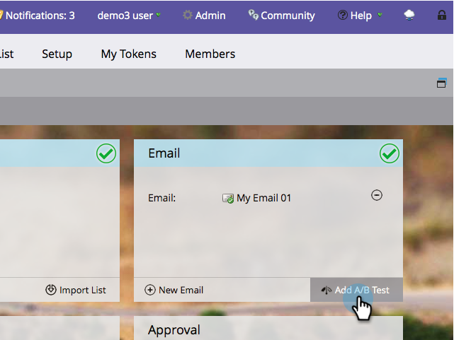
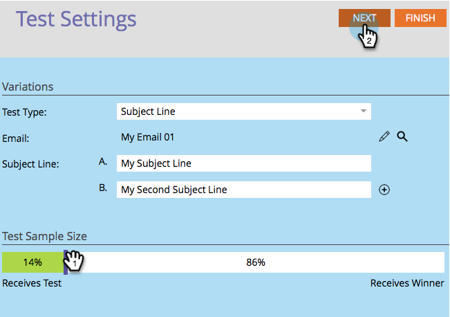

# Usar prueba A/B de “Línea de asunto” {#use-subject-line-a-b-testing}

Puede probar fácilmente sus correos electrónicos A/B. Una de las pruebas más comunes es la prueba **[!UICONTROL Línea de asunto]**.

>[!PREREQUISITES]
>
>[Agregar una prueba A/B](/help/marketo/product-docs/email-marketing/email-programs/email-program-actions/email-test-a-b-test/add-an-a-b-test.md)

1. En el **[!UICONTROL mosaico del correo electrónico]**, con el correo electrónico seleccionado, haga clic en **[!UICONTROL Agregar prueba A/B]**.

1. Se abrirá la ventana del editor de pruebas. Introduzca una o más líneas de asunto nuevas.

   >[!NOTE]
   >
   >La opción **A** se rellenará con la información contenida en el correo electrónico seleccionado.

   

   >[!TIP]
   >
   >Puede hacer clic en **+** para agregar más líneas de asunto.

1. Utilice el control deslizante para elegir el porcentaje de audiencia que quiere que reciba la prueba A/B y haga clic en **[!UICONTROL Siguiente]**.

   

   >[!CAUTION]
   >
   >**Le recomendamos que evite establecer el tamaño de la muestra en 100%**. Si utiliza una lista estática, si establece el tamaño de la muestra en 100 %, se enviará el correo electrónico a todos los miembros de la audiencia y el ganador no se dirigirá a nadie. Si usa una lista inteligente, si establece el tamaño de la muestra en 100%, enviará el correo electrónico a todos los integrantes de la audiencia _en ese momento_. Y cuando el programa de correo electrónico se vuelva a ejecutar más adelante, cualquier nueva persona que califique para la lista inteligente también recibirá el correo electrónico, ya que ahora se incluye en la audiencia.

   >[!NOTE]
   >
   >Las diferentes variaciones de temas tendrán incluso partes del tamaño de muestra de prueba seleccionado.

   Bien, ya casi llegamos. Ahora necesitamos [definir los criterios de ganador de la prueba A/B](/help/marketo/product-docs/email-marketing/email-programs/email-program-actions/email-test-a-b-test/define-the-a-b-test-winner-criteria.md).
