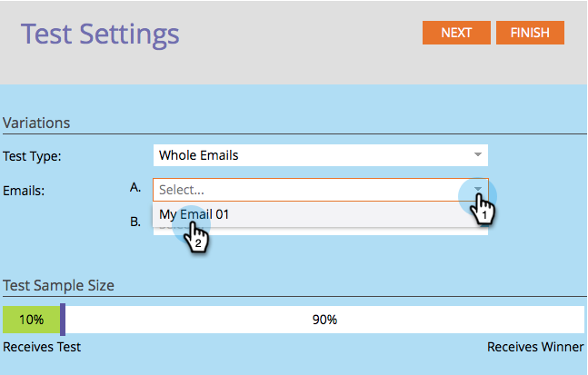

# Usar la prueba A/B &quot;Correo electrónico completo&quot; {#use-whole-email-a-b-testing}

Puede probar fácilmente los correos electrónicos con A/B. Una buena prueba es la prueba **Correo electrónico completo**. Así es como configurarlo.

>[!PREREQUISITES]
>
>[Añadir una prueba A/B](/help/marketo/product-docs/email-marketing/email-programs/email-program-actions/email-test-a-b-test/add-an-a-b-test.md)

1. En el mosaico Correo electrónico, con el correo electrónico seleccionado, haga clic en **Añadir prueba A/B**.

1. Se abre una nueva ventana. Haga clic en la lista desplegable **Tipo de prueba** y seleccione **Mensajes de correo electrónico completos**.

   

1. Si tiene información de prueba anterior (como una prueba de sujeto), puede hacer clic **Restablecer prueba** de forma segura.

   

1. Seleccione su primer correo electrónico.

   

1. Haga clic en **Añadir** para aplicar el correo electrónico.

   

   >[!TIP]
   >
   >Puede agregar varios correos electrónicos. Sin embargo, si agrega demasiados, puede ralentizar el proceso de prueba.

1. Seleccione su segundo correo electrónico.

   

1. Haga clic en **Añadir** para aplicar el segundo correo electrónico. Arrastre el control deslizante para elegir el porcentaje de la audiencia que desea que reciba la prueba A/B y haga clic en **Siguiente**.

   

   >[!NOTE]
   >
   >Las diferentes variaciones se enviarán a partes iguales del **Tamaño de la muestra de prueba** seleccionado.

   >[!CAUTION]
   >
   >**Le recomendamos que evite establecer el tamaño de la muestra en 100%**. Si está utilizando una lista estática, al establecer el tamaño de la muestra en 100 %, se envía el correo electrónico a todos los usuarios de la audiencia y el ganador no va a nadie. Si está utilizando una lista **inteligente**, al establecer el tamaño de la muestra en 100%, se envía el correo electrónico a todos los usuarios de la audiencia _en ese momento_. Cuando el programa de correo electrónico se ejecute de nuevo en una fecha posterior, cualquier persona nueva que califique para la lista inteligente también recibirá el correo electrónico porque ahora se incluye en la audiencia.

   Bien, ya casi llegamos. Ahora necesitamos [definir los criterios ganadores de la prueba A/B](/help/marketo/product-docs/email-marketing/email-programs/email-program-actions/email-test-a-b-test/define-the-a-b-test-winner-criteria.md).
