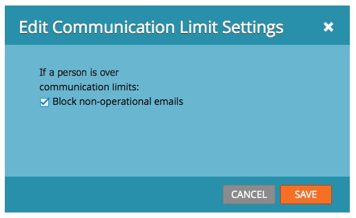

# Habilitar/deshabilitar los límites de comunicación en un programa de correo electrónico {#enable-disable-communication-limits-in-an-email-program}

Al ejecutar un programa de correo electrónico, puede elegir ignorar o respetar el [límites de comunicación de nivel de administrador](/help/marketo/product-docs/administration/email-setup/enable-communication-limits.md). Así es como hacerlo.

>[!NOTE]
>
>Los límites de comunicación son [se establece en la sección Administración](/help/marketo/product-docs/administration/email-setup/enable-communication-limits.md) y le ayuda a evitar enviar demasiados correos electrónicos a una persona.

1. Vaya a **Actividades de marketing**.

   

1. Busque y seleccione su programa de correo electrónico.

   

1. En el **Configuración** , haga doble clic en el elemento de línea límite de comunicación.

   

1. De forma predeterminada, los correos electrónicos no operativos se bloquean si se alcanzan los límites de comunicación, pero si desea omitirlos, desactive la casilla de verificación y haga clic en **Guardar**.

   

   Dejar **Bloquear correos electrónicos no operativos** marcada evitará enviar el correo electrónico a cualquier persona que haya recibido más correos electrónicos de los que permite la configuración de administración.
