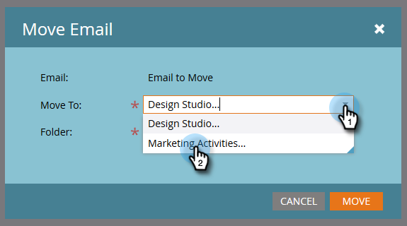

# Mover un mensaje de correo electrónico {#move-an-email}

¿Necesita mover un correo electrónico de un programa a otro? Así es como.

1. Vaya a **Actividades de marketing**.

   

1. Busque el correo electrónico que desee mover, haga clic con el botón derecho en él y seleccione **Mover**.

   

1. Haga clic en la lista desplegable **Mover a** y seleccione **Actividades de mercadotecnia**.

   

   >[!NOTE]
   >
   >En este ejemplo, se está moviendo un correo electrónico a otro programa, pero también se puede mover un correo electrónico a una carpeta de Design Studio.

1. Haga clic en la lista desplegable **Programa**, busque y seleccione el programa de destino y haga clic en **Mover**.

   

   Verás que tu correo electrónico ahora vive en el otro programa.

   

   ¡Bastante ingenioso!
