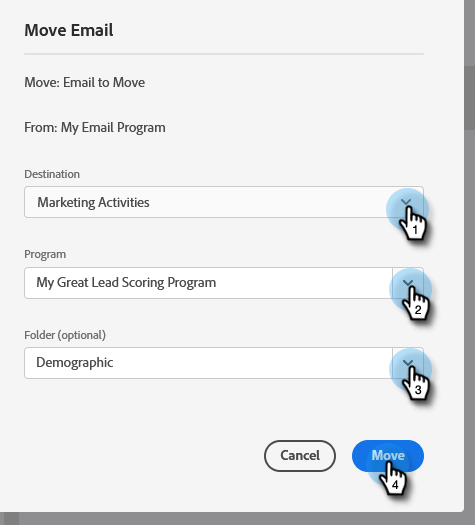

# Mover un correo electrónico {#move-an-email}

¿Necesita mover un correo electrónico de un programa a otro? Así es como.

1. Vaya a **Actividades de marketing**.

   

1. Busque el correo electrónico que quiera mover, haga clic con el botón derecho en él y seleccione **Mover**.

   

1. Seleccione **Destino**, **Programa** y **Carpeta** opcional. Seleccione **Mover**.

   

   >[!NOTE]
   >
   >En este ejemplo, se mueve un correo electrónico a otro programa, pero también se puede mover un correo electrónico a una carpeta de Design Studio.

   Verá que su correo electrónico ahora se encuentra en el otro programa.

   

   >[!NOTE]
   >
   >También puede arrastrar y soltar su correo electrónico en un nuevo destino dentro del árbol.
