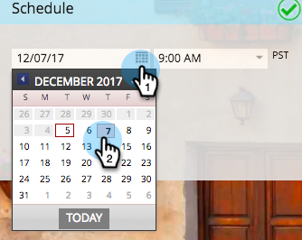
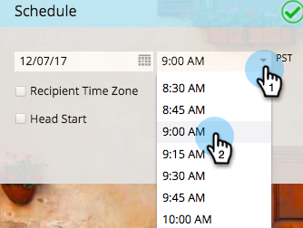
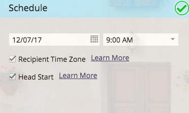

# Planifique su programa de correo electrónico {#schedule-your-email-program}

>[!PREREQUISITES]
>
>* [Crear un programa de correo electrónico](/help/marketo/product-docs/email-marketing/email-programs/creating-an-email-program/create-an-email-program.md)
>* [Definir una audiencia con una lista inteligente](/help/marketo/product-docs/email-marketing/email-programs/managing-people-in-email-programs/define-an-audience-with-a-smart-list.md) o [Definir una audiencia importando una lista](/help/marketo/product-docs/email-marketing/email-programs/managing-people-in-email-programs/define-an-audience-by-importing-a-list.md)
>
>* [Elija un correo electrónico existente](/help/marketo/product-docs/email-marketing/email-programs/email-program-actions/choose-an-existing-email.md) o [Cree un correo electrónico para un programa de correo electrónico](/help/marketo/product-docs/email-marketing/email-programs/email-program-actions/create-an-email-for-an-email-program.md)

Con el programa de correo electrónico creado, la audiencia definida y el correo electrónico seleccionado, querrás decirle a tu programa *cuándo* enviar el correo electrónico. Así es cómo se hace.

1. Vaya a **[!UICONTROL Actividades de marketing]**.

   

1. Seleccione su programa de correo electrónico.

   

1. En el mosaico **[!UICONTROL Programar]**, establezca la fecha.

   

1. Y luego la hora.

   

1. También puede elegir usar las características de [[!UICONTROL Zona horaria del destinatario]](/help/marketo/product-docs/email-marketing/email-programs/email-program-actions/scheduling-with-recipient-time-zone/schedule-email-programs-with-recipient-time-zone.md) y/o [[!UICONTROL Head Start]](/help/marketo/product-docs/email-marketing/email-programs/email-program-actions/head-start-for-email-programs.md).

   

   ¿Qué tan fácil fue eso? Lo único que queda es [aprobar un programa de correo electrónico](/help/marketo/product-docs/email-marketing/email-programs/email-program-actions/approve-unapprove-an-email-program.md) y ya está listo para comenzar.

>[!MORELIKETHIS]
>
>* [Programar programas de correo electrónico con zona horaria de destinatario](/help/marketo/product-docs/email-marketing/email-programs/email-program-actions/scheduling-with-recipient-time-zone/schedule-email-programs-with-recipient-time-zone.md)
>* [Head Start para programas de correo electrónico](/help/marketo/product-docs/email-marketing/email-programs/email-program-actions/head-start-for-email-programs.md)
