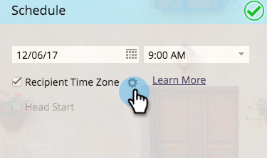

# Programar Programas de correo electrónico con huso horario de Destinatario {#schedule-email-programs-with-recipient-time-zone}

Existen dos escenarios posibles al programar un programa de correo electrónico mientras el huso horario de Destinatario está habilitado:

1. Programando la ejecución del programa **en las** próximas 25 horas
1. Programando el programa para que se ejecute **más** de 25 horas en el futuro (es decir, la semana que viene)

## Escenario 1: En 25 Horas {#scenario-within-hours}

Supongamos que aprueba un programa por correo electrónico con la zona horaria de Destinatario habilitada y una hora de entrega programada en las próximas 25 horas. Es posible que haya personas en su lista inteligente que vivan en zonas horarias en las que la hora programada ya ha pasado.

En este escenario, le permitimos decidir qué hacer con este subconjunto de personas cualificadas. Haga clic en el icono de engranaje situado junto al huso horario del **Destinatario** en el mosaico **Programar** del programa de correo electrónico.

Esto le ofrece dos opciones:

>[!NOTE]
>
>**Definición**
>
>* **Entregar el día siguiente en el huso** horario de destinatario: si el correo electrónico está programado para que salga el martes a las 9:00 a.m., las personas cualificadas que viven en zonas horarias en las que ya ha pasado la hora programada recibirán el correo electrónico el *miércoles* a las 9:00 a.m.
   >
   >
* **Entregar utilizando la hora** predeterminada del programa: si el correo electrónico está programado para que se publique el martes a las 9:00 a.m., las personas cualificadas que vivan en zonas horarias en las que ya haya transcurrido la hora programada recibirán el correo electrónico *en función de la configuración* del huso horario de su suscripción. Por lo tanto, si la configuración [del huso horario de](../../../../../product-docs/administration/settings/select-your-language-locale-and-time-zone.md) suscripción del cliente  está establecida en PDT América/Los Ángeles, estos destinatarios seguirán recibiendo el correo electrónico el martes a las 9:00 am PDT (en cualquier momento que se encuentre en sus propios husos horarios).

>

>[!NOTE]
>
>[Obtenga más](https://docs.marketo.com/display/DOCS/Understanding+Recipient+Time+Zone#UnderstandingRecipientTimeZone-CalculatingTimeZone) información sobre cómo Marketing calcula los husos horarios de los destinatarios.

Analicemos este escenario con más detalle. Digamos que estás en San Francisco, programando un correo electrónico a las 7:00 am para un envío de **9:00 am** . En su lista inteligente, hay personas de las siguientes regiones:

* San Francisco
* Texas
* Nueva York
* Italia

Las 9:00 am ya han pasado en Nueva York e Italia, por lo que personas calificadas en estas dos zonas horarias recibirán el correo electrónico según la Configuración **del** huso horario:

* **Entregar el día siguiente en el huso horario de destinatario:** Miércoles a las 9:00 am en sus respectivos husos horarios, **O**

* **Entregar utilizando la hora** predeterminada del programa: Martes a las 9:00am PDT (Nueva York - 12:00pm EDT e Italia - 6:00pm CET).

Una vez aprobado el programa, se inicio que se ejecute en 15 minutos.

>[!NOTE]
>
>Aunque el programa realizará el inicio del *proceso* de envío de correos electrónicos en 15 minutos, los correos electrónicos no se *enviarán* en ese momento. Los destinatarios recibirán mensajes de correo electrónico según la configuración **del** huso horario que elija.

## Escenario 2: Más de 25 horas {#scenario-more-than-hours}

En este segundo escenario, se aprueba un programa por correo electrónico con la zona horaria **de** Destinatario habilitada y una hora de entrega programada que superará las 25 horas en el futuro. En este caso, el programa se ejecutará en inicio a la hora programada en la **primera** zona horaria del mundo (UTC + 14:00). Es posible que haya personas que califiquen para su lista inteligente en todos los husos horarios del mundo, por lo que, a partir del primer huso horario, podemos enviar el correo electrónico en la fecha y hora programadas a todos los destinatarios de sus respectivos husos horarios.

Inicio de cabezal

Ahora, hablemos de cómo funciona [Head Inicio](../../../../../product-docs/email-marketing/email-programs/email-program-actions/head-start-for-email-programs.md) con **Destinatario Time Zone**. Nuestra función de Inicio de cabezal actual requiere que el programa se programe con al menos 12 horas de anticipación. ¿Qué significa eso para la zona horaria del Destinatario? Recuerde que cuando el huso horario de Destinatario está habilitado, se ejecuta el inicio de ejecución del programa de correo electrónico a la hora programada en el primer huso horario (UTC +14:00). Por lo tanto, para habilitar **tanto** el Inicio de cabezales como el huso horario de Destinatario, los programas de correo electrónico deben programarse al **menos 12 horas antes de la hora programada en UTC +14:00.**

Esto significa que si usted está en América/Los Ángeles y desea habilitar tanto el Inicio principal como el huso horario del Destinatario, debe programar el programa **34 horas** antes. ¿Cómo llegamos a este número?

  

En resumen, los programas de correo electrónico programados con el huso horario de Destinatario deben ejecutarse a la hora programada en el primer huso horario (es decir, donde llega a la medianoche primero) para poder alojar cada huso horario. Así que, si programas un programa por correo electrónico...

* **con un tiempo de envío *dentro* de las 25 horas**, los inicios de programa funcionan en 15 minutos. Los destinatarios que ya hayan pasado la hora programada recibirán el correo electrónico en función de la configuración del huso horario seleccionada.
* **con una hora de envío *más* *de 25 horas en el futuro***, los inicios de programa se ejecutan a la hora programada en la zona horaria más temprana (UTC +14:00).
* **con Inicio** principal, los inicios de programa procesan 12 horas antes de la hora programada en la zona horaria más temprana (UTC +14:00).

>[!CAUTION]
>
>Cualquier persona que cancele la suscripción entre el momento en que inicio el envío de su correo electrónico y el momento en que se entrega, seguirá recibiendo el correo electrónico. Le recomendamos que ajuste la notificación de cancelación de suscripción para reflejar que la cancelación de suscripciones puede tardar entre 1 y 2 días laborables en procesarse.

>[!MORELIKETHIS]
>
>* [Explicación del huso horario del Destinatario](understanding-recipient-time-zone.md)
>* [Inicio principal para Programas de correo electrónico](../../../../../product-docs/email-marketing/email-programs/email-program-actions/head-start-for-email-programs.md)
>* [Anular Envío de Programas de correo electrónico programados con el huso horario de Destinatario](abort-delivery-of-email-programs-scheduled-with-recipient-time-zone.md)

>

