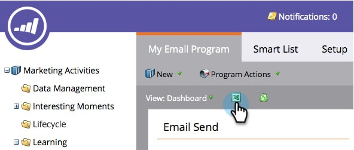

# Exportar panel del programa de correo electrónico a Excel {#export-email-program-dashboard-to-excel}

Una vez que haya ejecutado un programa de correo electrónico y tenga algunos datos en el panel, puede exportar esos datos sin procesar a Excel para un análisis más detallado. Así es cómo se hace.

1. Vaya a **[!UICONTROL Actividades de marketing]**.

   

1. Busque y seleccione su programa de correo electrónico.

   

   >[!NOTE]
   >
   >Si el programa de correo electrónico aún no se ha iniciado, no verá un panel porque no hay datos que ver.

1. Simplemente haga clic en el icono de Excel y comenzará la exportación.

   

   Bastante fácil, ¿verdad?
