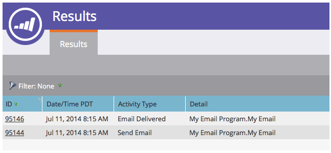

# Ver resultados del programa de correo electrónico {#view-email-program-results}

Al igual que la pestaña Resultados de las campañas inteligentes, puede ver la misma información en los programas de correo electrónico.

1. Vaya a **Actividades de marketing**.

   

1. Busque y seleccione su programa de correo electrónico.

   

   >[!NOTE]
   >
   >Si el programa de correo electrónico ya se ha ejecutado, se le llevará directamente al panel del programa de correo electrónico.

1. En **Ver**, seleccione **Panel de control de Campaign**.

   

1. En el **Audiencia** mosaico, haga clic en **Ver resultados**.

   

   ¡Ahí lo tienes!

   
