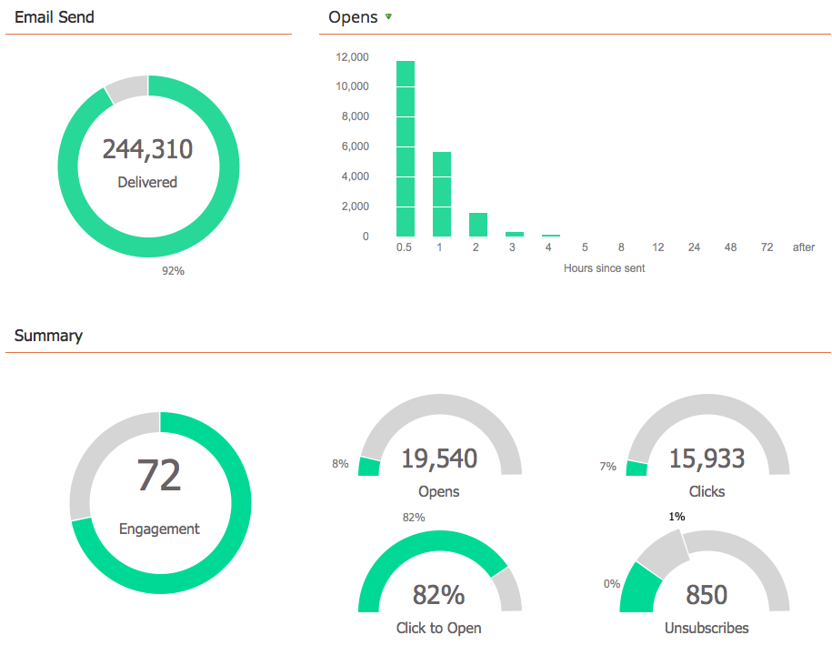

# Vista del Panel del Programa de correo electrónico {#view-the-email-program-dashboard}

Compruebe el rendimiento del programa de correo electrónico (con o sin una prueba A/B) con este panel.

## Seleccione el Programa de correo electrónico {#select-your-email-program}

1. Vaya a Actividades **de marketing**.

   

1. Busque y seleccione su programa de correo electrónico.

   

   >[!CAUTION]
   >
   >Si la prueba A/B o el programa de correo electrónico aún no se han iniciado, no verá ningún panel.

## Vista de prueba A/B de Programa de correo electrónico {#email-program-a-b-test-view}

Si ha agregado una prueba A/B al programa de correo electrónico y la prueba se está ejecutando, verá lo siguiente:

## Vista de Programa de correo electrónico {#email-program-view}

Como alternativa, si no agregó una prueba A/B *o* si la prueba ha finalizado, se mostrará lo siguiente:

>[!TIP]
>
>Experimente situando el cursor sobre las utilidades del gráfico. Le mostrará información adicional.

>[!MORELIKETHIS]
>
>* [Usar el Panel de Programa de correo electrónico - Vista de prueba A/B](../../../../product-docs/email-marketing/email-programs/email-program-actions/email-test-a-b-test/use-the-email-program-dashboard-a-b-test-view.md)
>* [Usar el Panel de Programa de correo electrónico](use-the-email-program-dashboard.md)

>

