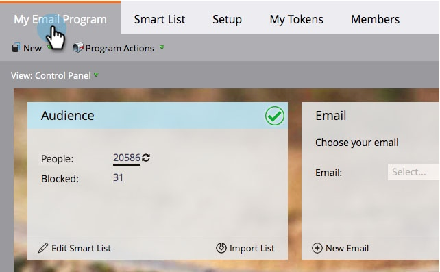

# Definir una audiencia con una lista inteligente {#define-an-audience-with-a-smart-list}

Una vez que [crear un programa de correo electrónico](/help/marketo/product-docs/email-marketing/email-programs/creating-an-email-program/create-an-email-program.md), querrá decirle a quién enviar el correo electrónico. Puede hacerlo de [importación de una lista de personas](/help/marketo/product-docs/email-marketing/email-programs/managing-people-in-email-programs/define-an-audience-by-importing-a-list.md) o con una lista inteligente. A continuación se muestra cómo lograr esto con una lista inteligente.

>[!PREREQUISITES]
>
>[Crear un programa de correo electrónico](/help/marketo/product-docs/email-marketing/email-programs/creating-an-email-program/create-an-email-program.md)

>[!NOTE]
>
>La definición de la audiencia solo funcionará cuando el programa de correo electrónico no se apruebe.

1. Vaya a **Actividades de marketing**.

   

1. Seleccione su programa de correo electrónico y haga clic en **Editar lista inteligente** en el **Audiencia** mosaico.

   

   >[!TIP]
   >
   >Asegúrese de que la vista está configurada en **Panel de control de Campaign** para encontrar esta configuración.

1. Busque los filtros que desee usar y arrástrelos al lienzo.

   

1. Defina los filtros.

   

1. Cuando haya terminado de agregar y definir filtros, vuelva a la pestaña del programa principal. Verá cuántas personas califican.

   

   ¡Excelente trabajo! Ahora es el momento de [elegir un correo electrónico existente](/help/marketo/product-docs/email-marketing/email-programs/email-program-actions/choose-an-existing-email.md) o [crear un correo electrónico](/help/marketo/product-docs/email-marketing/email-programs/email-program-actions/create-an-email-for-an-email-program.md) para enviar a estas personas.

>[!NOTE]
>
>**Definición**
>
>¿Viste el número bloqueado? Este número es un subconjunto de personas que cumplen los requisitos y representan a personas a las que no se puede enviar este correo electrónico porque:
>
>* Suscripción cancelada
>* Marketing suspendido
>* Está en la lista de bloqueos
>* Email no válido
>* Correo electrónico vacío
>
>Haga clic en el número para obtener una lista detallada de las personas bloqueadas del correo. **Tenga en cuenta:** Los mensajes de correo electrónico operativos se enviarán a las personas marcadas como no suscritas y el marketing suspendido.
>
>Utilice la variable  en el mosaico Audiencia para ver cuántas personas recibirán el correo electrónico.

>[!MORELIKETHIS]
>
>* [Elegir un correo electrónico existente](/help/marketo/product-docs/email-marketing/email-programs/email-program-actions/choose-an-existing-email.md)
>* [Creación de un correo electrónico para un programa de correo electrónico](/help/marketo/product-docs/email-marketing/email-programs/email-program-actions/create-an-email-for-an-email-program.md)

