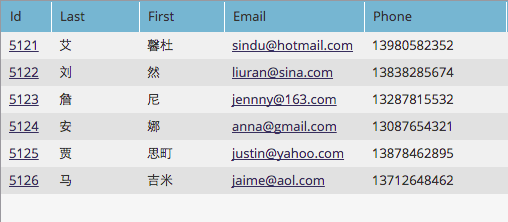

# Importar una lista de caracteres no latinos {#import-a-non-latin-characters-list}

¿Está intentando importar un archivo que no está en inglés? La lista tiene un aspecto perfecto al abrirla con Excel.

Sin embargo, al importarlo a Marketo, es posible que vea que los caracteres que no son ingleses no se recogen correctamente.

Esto se debe a que el archivo no se ha guardado correctamente para que Marketo reconozca todos los caracteres no latinos. La buena noticia es que hay algunos pasos simples que puede seguir para solucionarlo.

1. Seleccione **[!UICONTROL Guardar como]...** en el menú **[!UICONTROL Archivo]** de Excel.

   

1. Elija **[!UICONTROL Texto Unicode UTF-16 (.txt)]** como opción **[!UICONTROL Formato]**. Esto codificará el archivo de la manera en que Marketo puede mostrarlo.

   

   >[!NOTE]
   >
   >Marketo también es compatible con UTF-8, Shift-JIS o EUC-JP.

1. Excel guardará el nuevo archivo como un archivo de texto con la extensión .txt. Pero también convierte todas las comas del archivo en pestañas. Tenemos que volver a cambiarlo.

   >[!TIP]
   >
   >Puede abrir el archivo de texto con **[!DNL Notepad]** si utiliza Windows o **[!DNL TextEdit]** si utiliza un Mac.

   

1. Seleccione una ficha del documento y cópiela.

   

1. Seleccione **[!UICONTROL Buscar y reemplazar]...** en el menú **[!UICONTROL Editar]**.

   

   >[!TIP]
   >
   >La acción equivalente para los usuarios de Windows es: **[!UICONTROL Editar] > [!UICONTROL Reemplazar]...**

1. Pegue la ficha copiada en el paso 4 en el primer cuadro (que se reemplazará) y escriba una coma en el segundo cuadro (reemplazar con). Y haga clic en **[!UICONTROL Todos]**.

   

1. Y voilà, todas las comas están de vuelta y estamos listos para rodar.

   

1. Importe el nuevo archivo en Marketo y la información debería mostrarse correctamente esta vez.

   

   >[!NOTE]
   >
   >Los campos de fecha y hora que se importen se tratarán como hora central. Si tiene campos de fecha y hora en una zona horaria diferente, puede utilizar una fórmula de Excel para transformarla a la hora central (América/Chicago).

Sabemos que esto es raro, pero funciona. ¡Feliz importación!
