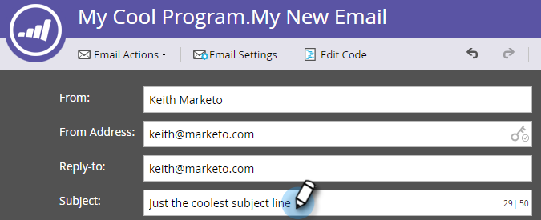

# Crear un mensaje de correo electrónico {#create-an-email}

Existen dos maneras principales de crear un correo electrónico en Marketing. Veamos ambos.

## Crear un correo electrónico en Design Studio {#create-an-email-in-the-design-studio}

1. Vaya a **Design Studio**.

   

1. Haga clic en la lista desplegable **Nuevo** y seleccione **Nuevo correo electrónico**.

   

   >[!NOTE]
   >
   >Cuando crea un correo electrónico en Design Studio, se puede encontrar en el árbol en &quot;Correos electrónicos&quot;.

¡Simple! Ahora por el otro lado...

## Crear un correo electrónico en Actividades de marketing {#create-an-email-in-marketing-activities}

1. Vaya a **Actividades de marketing**.

   

1. Seleccione el programa al que desee agregar el correo electrónico, haga clic en la lista desplegable **Nuevo** y seleccione **Nuevo recurso local**.

   

1. Haga clic en **Correo electrónico**.

   

   ¡Y eso es todo!

El método que elija le llevará al selector de plantillas.

1. Asigne un nombre a su correo electrónico, haga clic en la plantilla que desee utilizar y, a continuación, haga clic en **Crear**.

   

   >[!NOTE]
   >
   >Puede elegir entre una colección de plantillas de correo electrónico adaptables listas para usar o una plantilla guardada seleccionando **Mis plantillas** primero y siguiendo los mismos pasos.

1. Introduzca una línea de asunto. Hay un contador a la derecha para informarte si estás por debajo del máximo recomendado de 50 caracteres.

   

   Según la plantilla que haya elegido, tendrá diferentes opciones para editar el correo electrónico. Para correos electrónicos con módulos, consulte [Añadir módulos a su correo electrónico](/help/marketo/product-docs/email-marketing/general/email-editor-2/add-modules-to-your-email.md).

Ya se ha creado el correo electrónico, ¡así que edite!

>[!MORELIKETHIS]
>
>[Editar el encabezado de correo electrónico](/help/marketo/product-docs/email-marketing/general/creating-an-email/edit-your-email-header.md)
