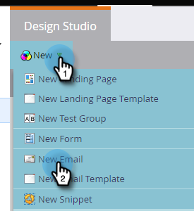

# Crear un correo electrónico {#create-an-email}

Existen dos formas principales de crear un correo electrónico en Marketo. Vamos a ver las dos cosas.

## Creación de un mensaje de correo electrónico en Design Studio {#create-an-email-in-the-design-studio}

1. Vaya a **[!UICONTROL Design Studio]**.

   

1. Haga clic en el menú desplegable **[!UICONTROL Nuevo]** y seleccione **[!UICONTROL Nuevo correo electrónico]**.

   

   >[!NOTE]
   >
   >Cuando crea un correo electrónico en [!UICONTROL Design Studio], se puede encontrar en el árbol debajo de &quot;[!UICONTROL Correos electrónicos]&quot;.

¡Sencillo! Ahora, para el otro lado...

## Crear un correo electrónico en las actividades de marketing {#create-an-email-in-marketing-activities}

1. Vaya a **[!UICONTROL Actividades de marketing]**.

   

1. Seleccione el programa al que desea agregar el correo electrónico, haga clic en la lista desplegable **[!UICONTROL Nuevo]** y seleccione **[!UICONTROL Nuevo recurso local]**.

   

1. Haga clic en **[!UICONTROL Correo electrónico]**.

   

El método que elija le lleva al selector de plantillas.

1. Asigne un nombre a su correo electrónico, haga clic en la plantilla que desee usar y luego haga clic en **[!UICONTROL Crear]**.

   

   >[!NOTE]
   >
   >Puede elegir entre una colección de plantillas de correo electrónico adaptables listas para usar o una plantilla que guardó seleccionando primero **[!UICONTROL Mis plantillas]** y siguiendo los mismos pasos.

1. Introduzca una línea de asunto. El límite de caracteres recomendado es 50.

   

   Según la plantilla que haya elegido, tendrá diferentes opciones para editar el correo electrónico. Para correos electrónicos con módulos, revisa [Agregar módulos al correo electrónico](/help/marketo/product-docs/email-marketing/general/email-editor-2/add-modules-to-your-email.md).

Su correo electrónico se ha creado, por lo que no debe editarlo.

>[!MORELIKETHIS]
>
>[Editar el encabezado del correo electrónico](/help/marketo/product-docs/email-marketing/general/creating-an-email/edit-your-email-header.md)
