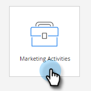

# Crear un correo electrónico {#create-an-email}

Existen dos formas principales de crear un correo electrónico en Marketo. Vamos a ver las dos cosas.

## Creación de un mensaje de correo electrónico en Design Studio {#create-an-email-in-the-design-studio}

1. Vaya a la **Design Studio**.

   

1. Haga clic en **Nuevo** y seleccione. **Nuevo correo electrónico**.

   

   >[!NOTE]
   >
   >Cuando crea un correo electrónico en Design Studio, se puede encontrar en el árbol en &quot;Correos electrónicos&quot;.

Simple! Ahora, para el otro lado...

## Crear un correo electrónico en las actividades de marketing {#create-an-email-in-marketing-activities}

1. Ir a **Actividades de marketing**.

   

1. Seleccione el programa al que desea agregar el correo electrónico y haga clic en el botón **Nuevo** y seleccione. **Nuevo recurso local**.

   

1. Clic **Correo electrónico**.

   

   ¡Y eso es todo!

El método que elija le lleva al selector de plantillas.

1. Asigne un nombre a su correo electrónico, haga clic en la plantilla que desee utilizar y, a continuación, haga clic en **Crear**.

   

   >[!NOTE]
   >
   >Puede elegir entre una colección de plantillas de correo electrónico adaptables listas para usar o una plantilla que guardó al seleccionar primero **Mis plantillas** y siguiendo los mismos pasos.

1. Introduzca una línea de asunto. El límite de caracteres recomendado es 50.

   

   Según la plantilla que haya elegido, tendrá diferentes opciones para editar el correo electrónico. Para correos electrónicos con módulos, consulte [Añadir módulos al correo electrónico](/help/marketo/product-docs/email-marketing/general/email-editor-2/add-modules-to-your-email.md).

Su correo electrónico se ha creado, por lo que no debe editarlo.

>[!MORELIKETHIS]
>
>[Editar el encabezado del correo electrónico](/help/marketo/product-docs/email-marketing/general/creating-an-email/edit-your-email-header.md)
