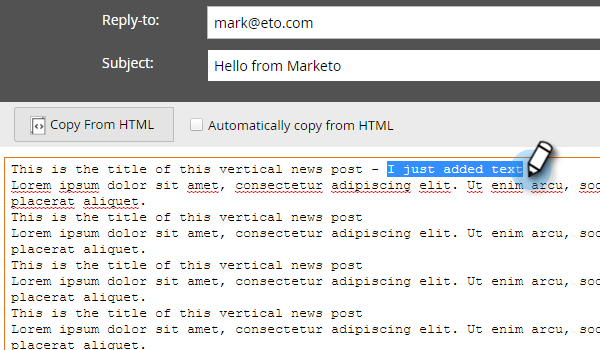

# Editar la versión de texto de un correo electrónico {#edit-the-text-version-of-an-email}

Al crear un correo electrónico, es posible que desee que su versión de texto esté redactada de forma diferente a la versión del HTML. De forma predeterminada, Marketo copia automáticamente el contenido de texto de cualquier elemento de texto enriquecido que haya en el correo electrónico a la versión de texto. Así es como editarlo.

>[!NOTE]
>
>Este no es un artículo sobre la creación de un correo electrónico de solo texto. Para obtener más información, consulte [Crear un correo electrónico de solo texto](/help/marketo/product-docs/email-marketing/general/creating-an-email/create-a-text-only-email.md).

1. En el editor de correo electrónico, haga clic en la **Texto** en la parte inferior del correo electrónico.

   

1. Desmarcar **Copiar automáticamente desde el HTML** para realizar cambios.

   

1. Haga doble clic en el área de texto.

   

1. Realice los cambios necesarios. Cuando haya terminado, simplemente cierre el editor o vuelva a la versión del HTML. Los cambios se guardarán automáticamente.

   

   Si solo tiene contenido estático, el texto se puede editar en un bloque grande (como se ve en el paso 3). Si tiene contenido dinámico, el texto se desglosará en diferentes secciones editables, como se ve a continuación.

   

¡Ya sabes!
