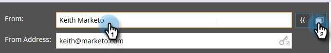

# Editar el encabezado del correo electrónico {#edit-your-email-header}

El encabezado del correo electrónico en Marketo es totalmente personalizable. Consta de cuatro campos:

* **De**: el nombre del remitente tal como desea que aparezca
* **Dirección remitente**: la dirección de correo electrónico del remitente tal como desea que aparezca
* **Responder a**: la dirección de correo electrónico a la que desea que se envíe la respuesta de una persona (puede ser diferente a la dirección De)
* **Asunto** - La línea de asunto del correo electrónico

Para editar estos valores, haga clic en cada campo e introduzca la información.

>[!TIP]
>
>Para establecer un nombre de remitente y un correo electrónico de remitente predeterminados, consulte [Cambiar el nombre de remitente predeterminado y la etiqueta de origen](/help/marketo/product-docs/administration/email-setup/change-the-default-from-email-and-from-label.md).

Si desea utilizar un token, haga clic primero dentro del campo deseado y, a continuación, haga clic en el icono del token.

También puede hacer que el campo sea dinámico mediante segmentos.

El icono de llave situado en el extremo derecho del campo Dirección de origen le permite saber si utiliza una firma DKIM personalizada.

El contador del extremo derecho del campo Asunto le ayuda a mantener la línea de asunto por debajo del límite recomendado de 50 caracteres.

Si supera los 50 caracteres, el contador se pondrá rojo para avisarle.

>[!MORELIKETHIS]
>
>[Información general del editor de correo electrónico v2.0](/help/marketo/product-docs/email-marketing/general/email-editor-2/email-editor-v2-0-overview.md)
