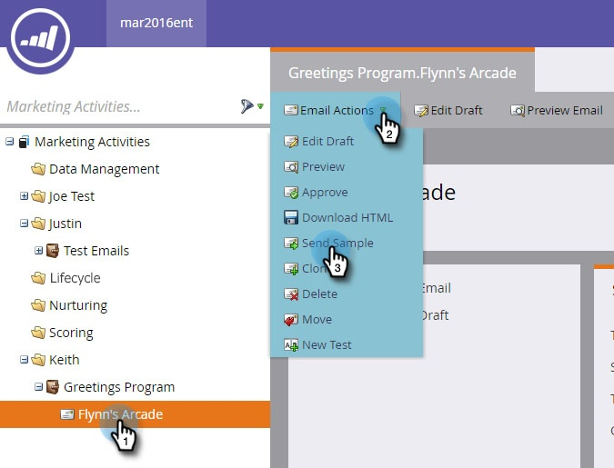
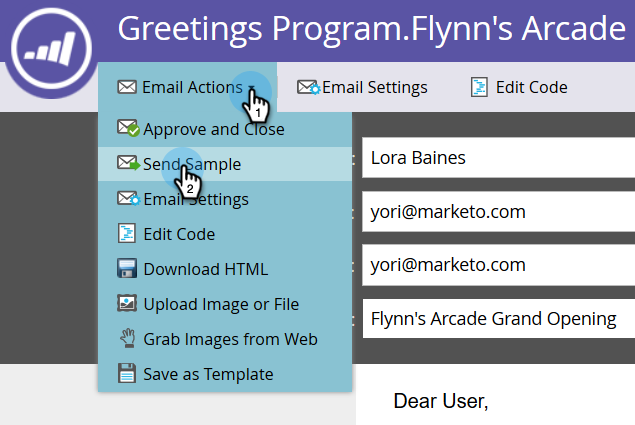
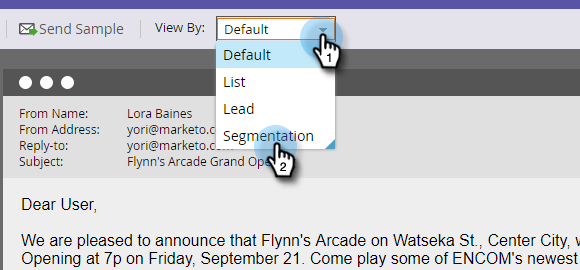
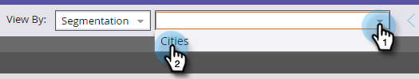
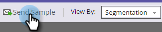

# Enviar muestra de correo electrónico {#send-a-sample-email}

Enviar muestras de un correo electrónico es rápido y sencillo. Para enviar un correo electrónico con contenido dinámico, consulte [Vista previa de un correo electrónico con contenido dinámico](/help/marketo/product-docs/email-marketing/general/functions-in-the-editor/preview-an-email-with-dynamic-content.md).

>[!NOTE]
>
>Debe tener el permiso **Ejecutar acciones de un solo flujo para la base de datos de Access** para enviar correos electrónicos de ejemplo.

## Enviar muestra de correo electrónico {#send-a-sample-email-1}

1. Busque y seleccione su correo electrónico. Haga clic en el menú desplegable **[!UICONTROL Acciones de correo electrónico]** y seleccione **[!UICONTROL Enviar muestra]**.
   

   >[!NOTE]
   >
   >Mis tokens resuelven el valor apropiado para el programa del correo electrónico.

1. Introduzca una o varias direcciones de correo electrónico para la entrega. Para varias direcciones de correo electrónico, utilice comas para separarlas. Haga clic en **[!UICONTROL Enviar]** cuando haya terminado.

   

   >[!IMPORTANT]
   >
   >Si introduce varias direcciones de correo electrónico, todos serán visibles para cada destinatario. El primero que introduzca será el destinatario principal y cada dirección de correo electrónico posterior será un destinatario de CC.

   >[!TIP]
   >
   >Si desea resolver tokens como una persona específica, elija dicha persona en la lista desplegable **persona** del paso 2.

## Enviar un correo electrónico de muestra durante la edición {#send-a-sample-email-while-editing}

1. Busque el correo electrónico, selecciónelo y haga clic en la ficha **[!UICONTROL Editar borrador]**.

   

1. Haga clic en **[!UICONTROL Acciones de correo electrónico]**, seleccione **[!UICONTROL Enviar muestra]**.

   

1. Escriba una dirección de correo electrónico para la entrega y haga clic en **[!UICONTROL Enviar]**.

   

   >[!NOTE]
   >
   >El campo de déclencheur solo es aplicable a aquellos que utilizan [scripts de correo electrónico](https://experienceleague.adobe.com/en/docs/marketo-developer/marketo/email-scripting).

## Enviar un correo electrónico de muestra basado en un segmento {#send-a-sample-email-based-on-a-segment}

>[!PREREQUISITES]
>
>[Aplicar segmentación a su correo electrónico](/help/marketo/product-docs/email-marketing/general/functions-in-the-editor/using-dynamic-content-in-an-email.md).

1. Busque el correo electrónico, selecciónelo y haga clic en la ficha **[!UICONTROL Editar borrador]**.

   

1. Haga clic en **[!UICONTROL Vista previa]**.

   

1. Haga clic en el menú desplegable **[!UICONTROL Ver por]** y seleccione **[!UICONTROL Segmentación]**.

   

1. Aparecerá una lista desplegable con las segmentaciones disponibles. Haga clic en él y seleccione el que desee.

   

1. Utilice las flechas para desplazarse por las opciones (en este caso, cambiamos dinámicamente la línea de asunto).

   

1. Haga clic en **[!UICONTROL Enviar muestra]** para recibir un correo electrónico de prueba del segmento en acción.

   

   >[!TIP]
   >
   >También puede enviar un correo electrónico de ejemplo basado en un segmento en el modo de edición del correo electrónico. Haga clic en el menú desplegable **[!UICONTROL Acciones de correo electrónico]**, seleccione **[!UICONTROL Enviar muestra]** y, a continuación, elija el segmento.

Es muy importante muestrear el contenido antes de lanzar una campaña. Medir dos veces, cortar una vez!
