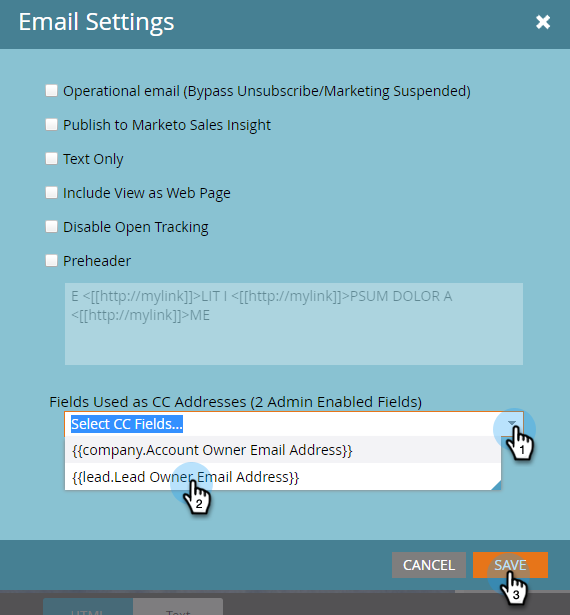

# Email CC {#email-cc}

Email CC permite enviar correos electrónicos especificados a través de Marketing para incluir destinatarios CC.

Esta función está disponible en todos los recursos de correo electrónico de Marketing to, independientemente de cómo se envíe el correo electrónico (campaña por lotes o desencadenantes). El destinatario CC recibirá una copia exacta del correo electrónico enviado a la persona de mercadotecnia elegida. Como tal, cualquier actividad de participación (aperturas, clics, etc.) se registrarán en el registro de actividades de la Persona con marca en la línea &quot;Para&quot; del correo electrónico. Sin embargo, la actividad de envío (enviada, entregada, devolución forzada, etc.) *que no sean &quot;rebotes blandos&quot;* no  **** se registrarán, ya que Marketo no puede distinguir los eventos de envío para la Persona de mercadotecnia de los destinatarios CC. Marketo solo contará con CC de hasta 100.000 personas a la vez. Si tu lista inteligente supera los 100.000 y es imperativo que todas las personas que estén en ella tengan CC&#39;d, te recomendamos que rompas tu lista.

>[!NOTE]
>
>Email CC no está diseñado para utilizarse con pruebas A/B. Puede usarlo de todas formas si lo desea, pero como técnicamente no es compatible, la asistencia técnica de marketing no podría ayudarle en la resolución de problemas.

## Configurar correo electrónico CC {#set-up-email-cc}

1. En Mi marketing, haga clic en **Administración**.

   

1. En el árbol, seleccione **Correo electrónico**.

   

1. Haga clic en **Editar configuración de Email CC**.

   

1. Seleccione hasta 25 campos de posibles clientes o Compañías de marketing (de tipo &quot;Correo electrónico&quot;) para que estén disponibles para su uso como direcciones CC dentro de los correos electrónicos. Haga clic en **Guardar** cuando termine.

   

## Uso de Email CC {#using-email-cc}

1. Seleccione su correo electrónico y haga clic en **Editar borrador**.

   

1. Haga clic en **Configuración de correo electrónico**.

   

1. Seleccione hasta cinco campos que desee usar para usuarios de CC. En este ejemplo, solo queremos el CC del propietario del posible cliente. Haga clic en **Guardar** cuando termine.

   

   ¡Es tan simple como eso! En el ejemplo anterior, cuando envíe el correo electrónico, el propietario principal de los destinatarios que elija será CC&#39;d.

   >[!NOTE]
   >
   >
   >Si hay una dirección de correo electrónico no válida en un campo CC, se omitirá.

   Para una identificación rápida, la vista Resumen de correo electrónico muestra si se seleccionaron o no los campos de Email CC.  

   Si el correo electrónico está aprobado, pero el administrador de marketing deshabilita uno o más campos CC antes de que se envíe el correo electrónico, **esas personas no recibirán un correo electrónico**. En ese escenario, la vista Resumen de correo electrónico mostrará en gris los campos deshabilitados después de la aprobación pero que se hayan enviado previamente:

   

   >[!NOTE]
   >
   >También verá el error anterior en la sección Configuración de correo electrónico del borrador de correo electrónico.

## Después del envío {#after-the-send}

* Si un destinatario de CC hace clic en un vínculo rastreado en el correo electrónico, haga clic en actividad (como cualquier otra actividad de participación) para asociarse con el destinatario principal del correo electrónico. Además, pueden hacer clic en una página con el código de seguimiento web de Marketing (munchkin.js), lo que provoca que se les recopile como el destinatario principal.

>[!TIP]
>
>Tiene la opción de [deshabilitar algunos o todos los vínculos de seguimiento](http://docs.marketo.com/x/IwAd) en un mensaje de correo electrónico.

* Después de ejecutar una campaña por correo electrónico, la actividad Enviar correo electrónico incluirá una lista de todas las direcciones CC incluidas para cada destinatario del correo. Si alguna dirección CC se omitió debido a la cancelación de la suscripción, también se anotará en la actividad.
* Los vínculos y las páginas de cancelación de suscripción funcionan normalmente en los correos electrónicos de CC. Esto permite a los destinatarios de CC cancelar la suscripción si lo desean (cumpliendo con las regulaciones antispam), y un registro de esta acción se almacenará en la base de datos de Marketing.
* Las personas que aparecen como no suscritas en la base de datos de Marketing recibirán **no** correos electrónicos a través de CC.

