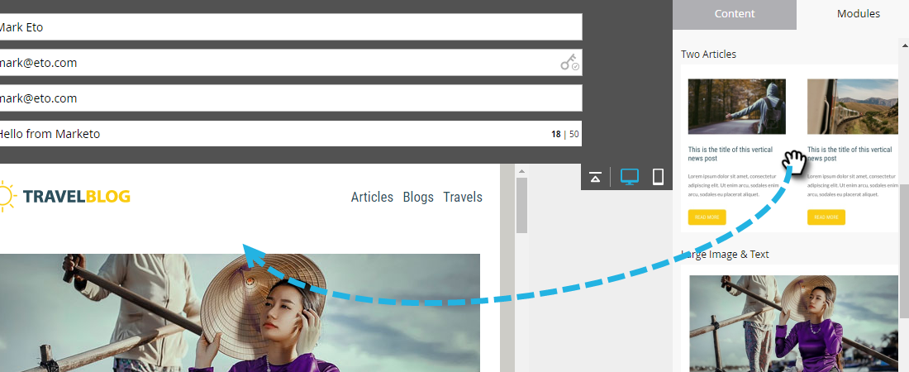

# Añadir módulos al correo electrónico {#add-modules-to-your-email}

En el Editor de correo electrónico 2.0, un módulo es una sección del correo electrónico que se define en la plantilla. Los módulos pueden contener cualquier combinación de elementos, variables y otro contenido del HTML. Añadirlos al correo electrónico es fácil.

1. Cree un correo electrónico. Asegúrese de elegir (o crear) una plantilla que contenga módulos.

   

   >[!NOTE]
   >
   >La mayoría de las plantillas de inicio de Marketo contienen módulos. También puede [cree su propio](/help/marketo/product-docs/email-marketing/general/email-editor-2/email-template-syntax.md#modules).

1. En el extremo derecho del correo electrónico, haga clic en **Módulos**.

   

1. Elija el módulo que desea añadir y arrástrelo hasta el correo electrónico.

   

1. Al arrastrar el módulo sobre verá &quot;Colocar aquí&quot; entre los demás módulos. Coloque el nuevo módulo donde desee.

   

1. Espere unos segundos y el correo electrónico se actualizará automáticamente, revelando el módulo que ha agregado.

   

## Mover un módulo dentro de un correo electrónico {#moving-a-module-within-an-email}

Existen dos maneras de mover un módulo.

1. Identifique el módulo que desee mover. Si no estás seguro de cómo se llama, pasa el ratón por encima y estará resaltado a la derecha.

   

1. Pase el ratón sobre el módulo de la derecha para mostrar el identificador. Agarrámoslo...

   

1. ...y arrastre el módulo a donde lo desee.

   

1. El otro método es hacer clic en el módulo del correo electrónico para seleccionarlo, revelando el icono de engranaje.

   

1. Haga clic en el icono del engranaje y seleccione **Subir** o **Bajar**, según a dónde desee que vaya el módulo.

   

Eso es todo.

>[!MORELIKETHIS]
>
>[Sintaxis de la plantilla de correo electrónico](/help/marketo/product-docs/email-marketing/general/email-editor-2/email-template-syntax.md)
