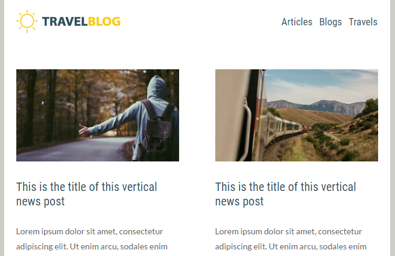

# Añadir módulos al correo electrónico {#add-modules-to-your-email}

En el Editor de correo electrónico 2.0, un módulo es una sección del correo electrónico que se define en la plantilla. Los módulos pueden contener cualquier combinación de elementos, variables y otro contenido de HTML. Añadirlos al correo electrónico es fácil.

1. Cree un correo electrónico. Asegúrese de elegir (o crear) una plantilla que contenga módulos.

   

   >[!NOTE]
   >
   >La mayoría de las plantillas iniciales de Marketo contienen módulos. También puede [cree los suyos propios](/help/marketo/product-docs/email-marketing/general/email-editor-2/email-template-syntax.md#modules).

1. En el extremo derecho del correo electrónico, haga clic en **Módulos**.

   

1. Elija el módulo que desea añadir y arrástrelo al correo electrónico.

   

1. Cuando arrastre el módulo, verá aparecer &quot;Colocar aquí&quot; entre los demás módulos. Coloque el nuevo módulo donde desee.

   

1. Espere unos segundos y el correo electrónico se actualizará automáticamente, lo que mostrará el módulo que ha agregado.

   

## Mover un módulo dentro de un correo electrónico {#moving-a-module-within-an-email}

Existen dos formas de mover un módulo.

1. Identifique el módulo que desea mover. Si no está seguro de cómo se llama, pase el ratón sobre él y aparecerá resaltado a la derecha.

   

1. Pase el ratón sobre el módulo de la derecha para ver el asa. Agárralo...

   

1. ...y arrastre el módulo a donde desee.

   

1. El otro método es hacer clic en el módulo del correo electrónico para seleccionarlo, lo que muestra el icono de engranaje.

   

1. Haga clic en el icono de engranaje y seleccione **Mover hacia arriba** o **Mover hacia abajo**, dependiendo de adónde desee que vaya el módulo.

   

Eso es todo lo que hay.

>[!MORELIKETHIS]
>
>[Sintaxis de plantilla de correo electrónico](/help/marketo/product-docs/email-marketing/general/email-editor-2/email-template-syntax.md)
