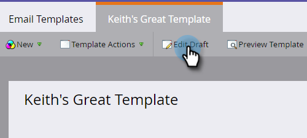
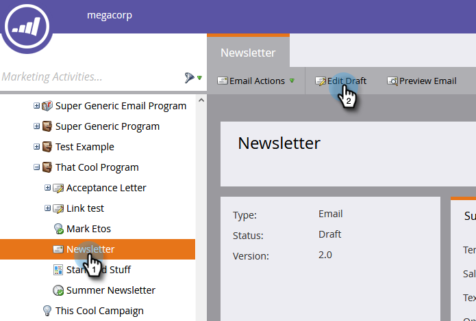

# Crear una plantilla de correo electrónico {#create-an-email-template}

Siga estos pasos para crear una nueva plantilla de correo electrónico.

>[!NOTE]
>
>El Soporte de Marketo no está configurado para ayudar a solucionar problemas con el HTML personalizado. Para obtener ayuda del HTML, consulte con un desarrollador web.

>[!CAUTION]
>
>El editor que utilizamos convierte los valores de las propiedades CSS de color y color de fondo a minúsculas, por lo que evite utilizar mayúsculas y minúsculas y utilice nombres en minúsculas o guiones en su lugar.

## Crear nueva plantilla de correo electrónico {#create-a-new-email-template}

1. Haga clic en **Design Studio**.

   

1. Haga clic en **Nuevo** y luego seleccione **Nueva plantilla de correo electrónico**.

   

1. Asigne un nombre a la nueva plantilla y haga clic en **Crear**.

   

1. Para empezar a editar la nueva plantilla, haga clic en **Editar borrador**.

   

   >[!CAUTION]
   >
   >Aunque no hay límite estricto, una vez que más de 500 correos electrónicos utilizan una plantilla de correo electrónico, la nueva aprobación de esa plantilla después de una actualización podría provocar problemas de rendimiento. Recomendamos que, una vez que una plantilla de correo electrónico tenga 500 correos electrónicos asociados, cree una nueva plantilla.

## Guardar un correo electrónico como plantilla {#save-an-email-as-a-template}

Si ha creado un correo electrónico que desea guardar como plantilla para uso futuro, siga estos sencillos pasos.

1. Haga clic en **Actividades de marketing**.

   

1. Busque y seleccione su correo electrónico, luego haga clic en **Editar borrador**.

   

1. Haga clic en el menú desplegable **Acciones de correo electrónico** y seleccione **Guardar como plantilla**.

   

1. Haga clic en la lista desplegable **Carpeta**, seleccione dónde desea que se encuentre la plantilla y haga clic en **Guardar**.

   

   ¡Y eso es todo!

   >[!CAUTION]
   >
   >Al guardar un correo electrónico como plantilla, los valores de las variables no se transfieren. Las variables seguirán utilizando los valores predeterminados especificados en la plantilla subyacente. Los módulos disponibles en el correo electrónico no se transferirán a menos que se hayan insertado en el cuerpo del correo electrónico.

Para personalizar su plantilla de correo electrónico, consulte el artículo siguiente.

>[!MORELIKETHIS]
>
>[Sintaxis de plantilla de correo electrónico](/help/marketo/product-docs/email-marketing/general/email-editor-2/email-template-syntax.md)
