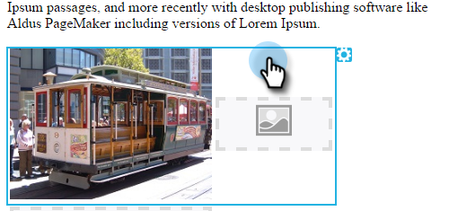

# Editar elementos en un correo electrónico {#edit-elements-in-an-email}

Los correos electrónicos pueden contener cuatro elementos diferentes: texto enriquecido, imágenes, fragmentos de código y vídeo. A continuación, se muestra cómo editar cada uno.

## Cómo editar el elemento de texto enriquecido {#how-to-edit-the-rich-text-element}

1. Busque el correo electrónico, selecciónelo y haga clic en **[!UICONTROL Editar borrador]**.

   

1. Se abrirá el editor de correo electrónico. Seleccione el texto enriquecido, haga clic en el icono de engranaje y seleccione **[!UICONTROL Editar]**.

   

   También puede situarse sobre el elemento en el panel derecho, lo que provoca que aparezca el icono de engranaje.

   

1. Agrega o edita tu texto y pulsa **[!UICONTROL Guardar]**.

   

   >[!NOTE]
   >
   >También puede agregar imágenes, tokens, tablas y otros elementos. Consulte [Uso del editor de texto enriquecido](/help/marketo/product-docs/email-marketing/general/understanding-the-email-editor/using-the-rich-text-editor.md).

   >[!CAUTION]
   >
   >Evite copiar y pegar texto desde un origen de texto enriquecido, como un sitio Web o un documento de Word. Primero pegue el texto enriquecido en un editor de texto sin formato, como [!DNL Notepad] (Windows) o [!DNL TextEdit] (Mac). Una vez &quot;limpio&quot;, puede copiarlo desde el editor de texto sin formato y pegarlo en su correo electrónico.

## Cómo editar el elemento de imagen {#how-to-edit-the-image-element}

1. Haga clic dentro del módulo con el elemento de imagen para seleccionarlo.

   

1. Haga clic en el elemento de imagen que desee editar, luego haga clic en el icono de engranaje y seleccione **[!UICONTROL Editar]**.

   

   >[!NOTE]
   >
   >También puede hacer doble clic en el elemento para comenzar a editarlo.

1. Se muestra el editor de imágenes.

   

   Tiene tres opciones para insertar una imagen. Vamos a mirar a cada uno.

   **URL externa**

   >[!NOTE]
   >
   >Si desea utilizar un token de Marketo, utilice esta opción. Tenga en cuenta que cuando utilice un token, la imagen aparecerá dañada en el editor, pero se procesará en el modo de vista previa y en el correo electrónico de envío de muestra.

   Para utilizar una URL externa, pegue primero la URL de la imagen. Modifique las dimensiones para adaptarlas a sus necesidades y agregue [!UICONTROL Texto alternativo] (opcional). Luego presione **[!UICONTROL Intercambiar]**.

   

   **Mi equipo**

   Para cargar una imagen desde el equipo, haz clic en **[!UICONTROL Examinar]**.

   

   Desplácese hasta donde se encuentra la imagen en el equipo e insértela.

   

   Modifique las dimensiones para adaptarlas a sus necesidades, cambie el [!UICONTROL Texto alternativo] (opcional) y luego presione **[!UICONTROL Intercambiar]**.

   

   >[!NOTE]
   >
   >Si reemplazas una imagen, deberás marcar la casilla **[!UICONTROL Sobrescribir imagen existente]** que aparece debajo de la URL/nombre de la imagen.

   **Estudio de diseño**

   Para insertar una imagen desde [!UICONTROL Design Studio], simplemente localícela...

   

   ...e insertarlo. Modifique las dimensiones para adaptarlas a sus necesidades, cambie el [!UICONTROL Texto alternativo] (opcional) y luego presione **[!UICONTROL Intercambiar]**.

   

## Cómo editar el elemento de fragmento {#how-to-edit-the-snippet-element}

1. Haga clic dentro del módulo con el elemento Snippet.

   

1. Haga clic en el elemento Snippet, luego en el icono de engranaje y seleccione **[!UICONTROL Edit]**.

   

1. Busque el fragmento, selecciónelo y haga clic en **[!UICONTROL Guardar]**.

   

1. A continuación, se rellena el fragmento.

   

## Cómo editar el elemento de vídeo {#how-to-edit-the-video-element}

1. Haga clic dentro del módulo con el elemento de vídeo.

   

1. Haga clic en el elemento de vídeo, luego en el icono de engranaje y seleccione **[!UICONTROL Editar]**.

   

1. Pegue en la dirección URL del vídeo desde [!DNL Vimeo] o YouTube. A continuación, haga clic en en el cuadro URL para que se cargue la previsualización. Modifique las dimensiones para adaptarlas a sus necesidades, agregue [!UICONTROL Texto alternativo] (opcional) y luego presione **[!UICONTROL Insertar]**.

   

   >[!NOTE]
   >
   >Para vídeos de YouTube, utilice la dirección URL completa de la barra de direcciones, no la URL de acceso directo que se encuentra en la opción Compartir.

¡Diviértete diseñando el correo electrónico perfecto!
