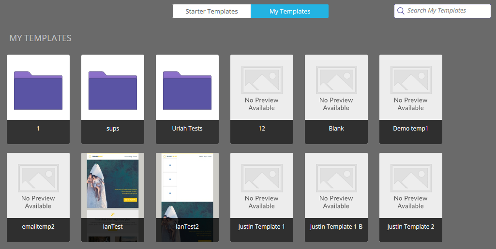
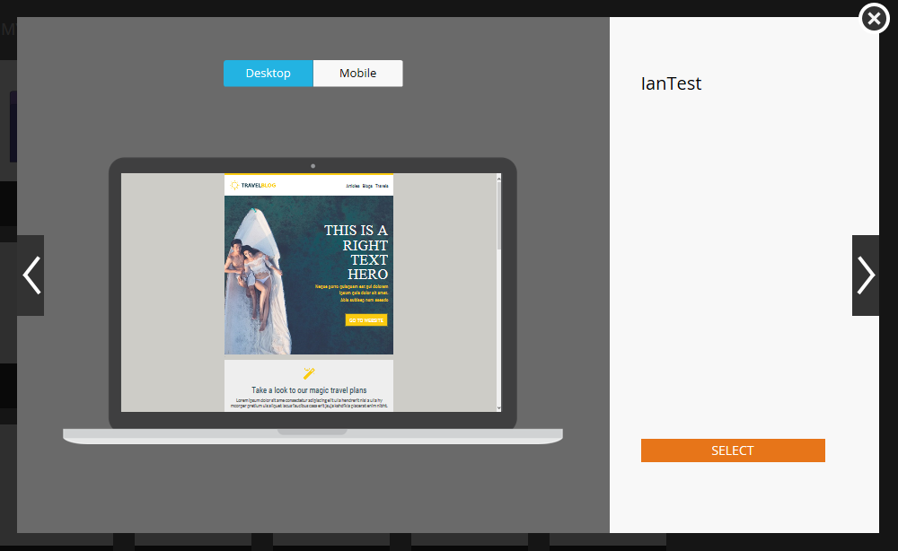

# Información general del selector de plantillas de correo electrónico {#email-template-picker-overview}

Cuando [crear un correo electrónico](/help/marketo/product-docs/email-marketing/general/creating-an-email/create-an-email.md), tiene varias plantillas gratuitas para elegir. También puede crear su propia plantilla y guardarla para usarla en el futuro.

**Nombre** será el nombre del correo electrónico que cree en función de la plantilla, no la plantilla misma. **Descripción** también se aplica al correo electrónico y es opcional.

Si su correo electrónico es crítico y desea que eluda los límites de comunicación, [hacer que funcione](/help/marketo/product-docs/email-marketing/general/functions-in-the-editor/make-an-email-operational.md) marcando la casilla . **Abrir en editor** está seleccionada de forma predeterminada y, simplemente, significa que desea comenzar a editar el nuevo correo electrónico inmediatamente. **Crear** significa, crear!

**Plantillas iniciales** incluye una colección de plantillas de correo electrónico adaptables listas para usar. Puede utilizarlos tal cual, o personalizarlos según prefiera.

**Mis plantillas** consta de todas las plantillas que ha creado. También puede tener carpetas.

Todas las carpetas que aparecen en Correo electrónico > Plantillas en el árbol de Design Studio estarán disponibles en **Mis plantillas**.

Para obtener una vista previa de una plantilla, pase el ratón sobre su miniatura y haga clic en **Vista previa**. También puede hacer doble clic en él.

El previsualizador le muestra cómo se representará la plantilla en un equipo de escritorio...

...y un dispositivo móvil.

Si le gusta esta plantilla, selecciónela haciendo clic en **Select** en la parte inferior derecha. ¿Quieres seguir mirando? Haga clic en el **X** en la esquina superior derecha. Utilice las flechas izquierda y derecha para desplazarse por las plantillas.

También puede hacer clic con el botón derecho en una miniatura de plantilla para obtener más opciones.

>[!NOTE]
>
>Lo genial de las miniaturas de las plantillas es que están activas. Por lo tanto, si realiza un cambio en una plantilla, la miniatura cambia junto con ella.

Muy bien cuidado.

>[!MORELIKETHIS]
>
>* [Sintaxis de la plantilla de correo electrónico](/help/marketo/product-docs/email-marketing/general/email-editor-2/email-template-syntax.md)
>* [Crear un correo electrónico](/help/marketo/product-docs/email-marketing/general/creating-an-email/create-an-email.md)

