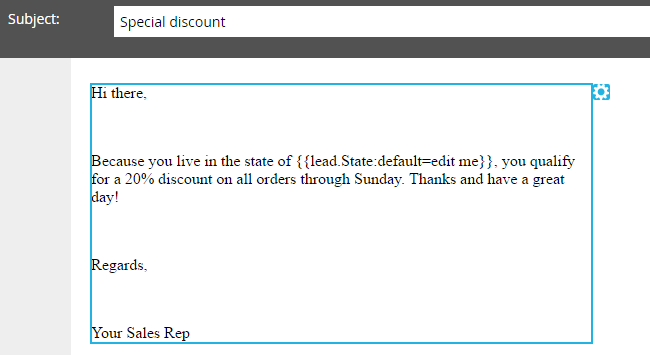

# Añadir un fragmento de código a un correo electrónico {#add-a-snippet-to-an-email}

Los fragmentos de código son bloques reutilizables de texto enriquecido y gráficos que puede utilizar en sus correos electrónicos y páginas de aterrizaje.

>[!PREREQUISITES]
>
>[Crear un fragmento](/help/marketo/product-docs/personalization/segmentation-and-snippets/snippets/create-a-snippet.md)

>[!NOTE]
>
>No puede incrustar ninguno [Sintaxis de correo electrónico de Marketo](/help/marketo/product-docs/email-marketing/general/email-editor-2/email-template-syntax.md)en fragmentos; lo hará **no** trabajar en un correo electrónico. Los fragmentos de código solo deben contener cuerpo (HTML + TEXTO).

1. Busque el correo electrónico, selecciónelo y haga clic en **Editar borrador**.

   

1. Seleccione el área editable que desea convertir en un fragmento, haga clic en el icono de engranaje y seleccione **Reemplazar por fragmento**.

   

1. Seleccione el fragmento que desee y haga clic en **Guardar**.

   

   >[!NOTE]
   >
   >En la lista desplegable solo aparecen los fragmentos aprobados.

   

   >[!NOTE]
   >
   >Cada vez que actualice y apruebe el fragmento, los cambios se reflejarán en el correo electrónico. El correo electrónico se redactará a menos que apruebe el fragmento con [Sin Borrador](/help/marketo/product-docs/administration/users-and-roles/enable-no-draft-for-snippets.md).

Es una forma rápida y sencilla de reutilizar contenido dinámico.
