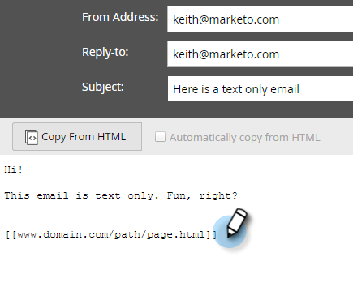

# Añadir vínculos rastreados a un correo electrónico de texto {#add-tracked-links-to-a-text-email}

>[!PREREQUISITES]
>
>* [Crear un correo electrónico de solo texto](/help/marketo/product-docs/email-marketing/general/creating-an-email/create-a-text-only-email.md)
>* [Editar elementos en un mensaje de correo electrónico](/help/marketo/product-docs/email-marketing/general/email-editor-2/edit-elements-in-an-email.md)

Los vínculos de correo electrónico de texto se pueden rastrear en Marketo. Vamos a ver cómo funciona.

1. Seleccione su correo electrónico y haga clic en **Editar borrador**.

1. Seleccione su correo electrónico y haga clic en **[!UICONTROL Editar borrador]**.

   

1. Haga doble clic en el área editable a la que desee agregar el vínculo.

   

1. Escriba la dirección URL entre corchetes, de la siguiente manera: `[[www.domain.com/path/page.html]]`.

   

   >[!CAUTION]
   >
   >Si un mensaje de correo electrónico se envió hace más de 365 días **y** nadie ha hecho clic en ninguno de sus vínculos en los últimos 180 días, Marketo Engage elimina la ruta a la dirección URL de nuestra base de datos, lo que provocará que se rompa el vínculo. Si necesita que el vínculo sea permanente, no utilice el seguimiento.

1. Cierre el editor y no se olvide de aprobar el borrador.

   

>[!NOTE]
>
>La funcionalidad de la clase mktNoTok no funciona con vínculos a los que se puede realizar un seguimiento en correos electrónicos de texto. Solo para correos electrónicos de HTML.
