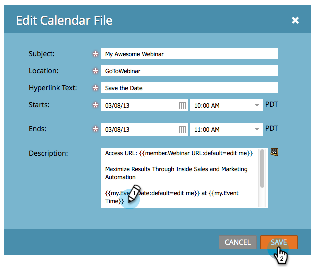

# Crear un archivo de eventos de calendario (.ics) {#create-a-calendar-event-ics-file}

Un token de archivo de calendario le permite agregar un vínculo de evento de calendario (.ics) a los correos electrónicos y las páginas de aterrizaje de Marketo.

1. Dentro de tu programa, ve a la ficha **Mis tokens**.

   

1. Arrastre un **archivo de calendario** token al lienzo.

   

1. Escriba un **Nombre de token** y **Editar**.

   

1. Escriba los detalles y haga clic en **Guardar**.

   

¡Misión cumplida! Asegúrate de probarlo.

>[!MORELIKETHIS]
>
>* [Incluir un evento de calendario (.ics) en un mensaje de correo electrónico](/help/marketo/product-docs/email-marketing/general/functions-in-the-editor/include-a-calendar-event-ics-in-an-email.md)
>* [Incluir un archivo ICS de evento de calendario en una página de aterrizaje](/help/marketo/product-docs/demand-generation/landing-pages/personalizing-landing-pages/include-a-calendar-event-ics-file-in-a-landing-page.md)
