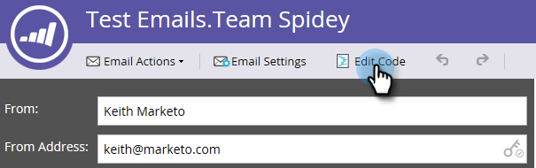

# Editar el HTML de un correo electrónico {#edit-an-emails-html}

A veces, es posible que tenga que modificar el HTML subyacente de un correo electrónico. A veces, puede utilizar un sistema externo para diseñar y crear el código de su correo electrónico. De cualquier manera, puede importar y/o editar código fácilmente desde dentro del editor de correo electrónico.

## Editar HTML {#edit-html}

1. Seleccione el correo electrónico y haga clic en **Editar borrador**.

   

1. Haga clic en **Editar código**.

   

1. Realice cualquier cambio. Haga clic en **Guardar** cuando haya terminado.

   

   >[!NOTE]
   >
   >Cambie lo que desee. Puede reemplazar todo el HTML o realizar ajustes menores.

1. Haga clic en el **Acciones de código** para descargar el código como archivo .html , en línea con el CSS o validar el HTML.

   

   >[!NOTE]
   >
   >La práctica recomendada para los correos electrónicos es hacer que todos sus estilos estén en línea. Varios clientes de correo electrónico no admiten CSS dentro de la función `<head>` para obtener más información.

## Romper un correo electrónico de su plantilla {#breaking-an-email-from-its-template}

Estos cambios de código **will not** romper un correo electrónico de su plantilla:

* Edición del contenido de cualquier módulo (incluida la adición de nuevos elementos dentro del módulo)
* Adición de un nuevo módulo al contenedor
* Eliminación de un módulo del contenedor

* Cambiar atributos específicos de mkto (por ejemplo, &quot;mktoName&quot; o &quot;mktoImgUrl&quot;) de cualquier elemento fuera de un módulo
* Edición del contenido de cualquier elemento (texto enriquecido, imagen, vídeo, etc.) fuera de un módulo

Estas acciones puede realizar en el editor de código **will** desglose el correo electrónico de su plantilla:

* Cambio de cualquier elemento del código fuera de un elemento o módulo
* Añadir o cambiar atributos que no sean mkto (por ejemplo, &quot;id&quot; o &quot;style&quot;) de cualquier elemento fuera de un módulo
* Eliminación de un elemento que está fuera de un módulo

## Código de búsqueda {#search-code}

Utilice la funcionalidad Buscar código para buscar y reemplazar contenido de forma eficaz en el código de HTML de su correo electrónico.

1. En el código de su correo electrónico, haga clic en **Código de búsqueda**.

   

1. Introduzca lo que desea buscar y haga clic en **Buscar siguiente** para buscar hacia delante o **Buscar anterior** para buscar hacia atrás. También tiene la opción de **Reemplazar** y **Reemplazar todo**.

   

1. Haga clic en **Cerrar** cuando haya terminado.

   

   >[!NOTE]
   >
   >El código de búsqueda también está disponible en la sección [Editor de plantillas de correo electrónico](/help/marketo/product-docs/email-marketing/general/email-editor-2/create-an-email-template.md).

Le recomendamos que continúe editando sus correos electrónicos utilizando la funcionalidad integrada de Marketo, pero este editor de código proporciona flexibilidad si lo necesita.
