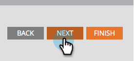
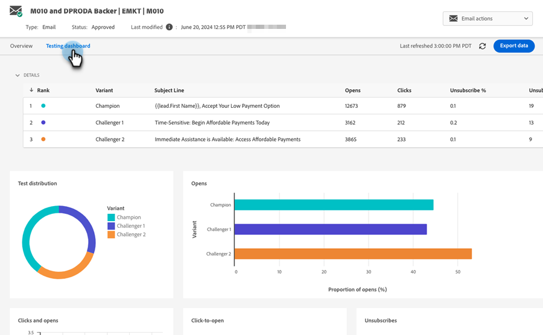

# Campeón/Aspirante: análisis {#champion-challenger-analytics}

Reciba alertas de informes o revise el panel Campeón/Challenger para obtener análisis útiles.

>[!PREREQUISITES]
>
>[Campeón/Challenger: Definir criterios de campeón](/help/marketo/product-docs/email-marketing/general/functions-in-the-editor/email-tests-champion-challenger/champion-challenger-define-champion-criteria.md)

## Configurar alertas de informes {#configure-report-alerts}

Marketo le enviará informes sobre cómo va la prueba de correo electrónico. Así es como se programa.

1. Programemos el informe para que se envíe una vez a la semana el viernes a las 9 a. m.

   

   >[!TIP]
   >
   >Si lo desea, puede seleccionar varios días de la semana. Haga clic para seleccionar, haga clic de nuevo para anular la selección.

1. Introduzca las direcciones de correo electrónico a las que desea enviar los informes.

   

1. Haga clic en **Next**.

   

1. Compruebe que toda la información es correcta y haga clic en **Cerrar**.

   

   El informe incluirá detalles como: tipo de prueba, criterios de ganador, cantidad de correos electrónicos abiertos, etc. También habrá un enlace directo a la prueba en sí, lo que le permite declarar el ganador! Cosas geniales.

## Tablero de campeón/aspirante {#champion-challenger-dashboard}

El panel de control Campeón/Challenger proporciona análisis detallados sobre el rendimiento del control y las variantes de la experimentación Campeón/Challenger (aperturas, clics, porcentaje de cancelación de suscripción y otras variables utilizadas durante la configuración de la prueba de correo electrónico). El panel también proporciona detalles de distribución sobre la audiencia de destino para varias variantes de correo electrónico, así como la proporción agregada de aperturas, clics, proporción de clics respecto a aperturas y cancelaciones de suscripción para todas las variantes.

