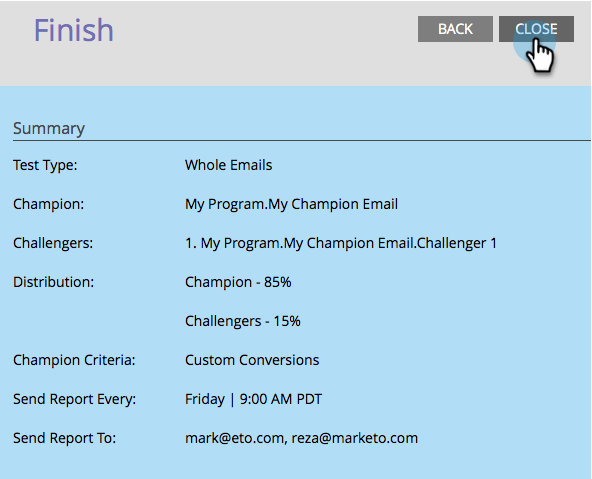

# Campeón/Desafío: Configurar alertas de informes {#champion-challenger-configure-report-alerts}

Marketo le enviará informes sobre cómo va la prueba de correo electrónico. Así es como programarlo.

>[!PREREQUISITES]
>
>[Campeón/Desafío: Definir criterios de campeón](/help/marketo/product-docs/email-marketing/general/functions-in-the-editor/email-tests-champion-challenger/champion-challenger-define-champion-criteria.md)

1. Programemos el envío del informe una vez por semana el viernes a las 9 a. m.

   

   >[!TIP]
   >
   >Si lo desea, puede seleccionar varios días de la semana. Haga clic para seleccionar y vuelva a hacer clic para anular la selección.

1. Introduzca las direcciones de correo electrónico a las que desea que se envíen los informes.

   

1. Haga clic en **Siguiente**.

   

1. Compruebe que toda la información es correcta y haga clic en **Cerrar**.

   

   El informe incluirá detalles útiles, como: tipo de prueba, criterios de ganador, número de aperturas de correo electrónico y más. También habrá un vínculo directo a la prueba en sí, lo que le permite declarar el ganador. Genial.

   >[!MORELIKETHIS]
   >
   >[Campeón/Desafío: Aprobar la prueba de correo electrónico](/help/marketo/product-docs/email-marketing/general/functions-in-the-editor/email-tests-champion-challenger/champion-challenger-approve-your-email-test.md)
