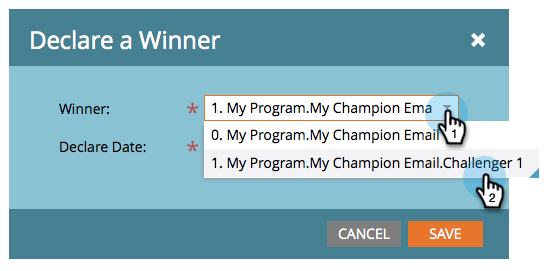
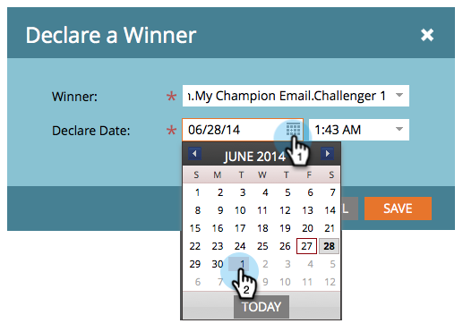

# Campeón/Desafío: Declarar campeón {#champion-challenger-declare-a-champion}

Cuando esté listo, puede declarar un campeón para la prueba de correo electrónico.

>[!MORELIKETHIS]
>
>[Campeón/Desafío: Aprobar la prueba de correo electrónico](/help/marketo/product-docs/email-marketing/general/functions-in-the-editor/email-tests-champion-challenger/champion-challenger-approve-your-email-test.md)

1. Vaya a **Actividades de marketing**.

   

1. Busque y haga clic con el botón secundario en la prueba de correo electrónico y, a continuación, haga clic en **Declarar campeón**.

   

1. Seleccione el **Ganador** de su elección.

   

1. Configure las variables **Declarar fecha**.

   >[!NOTE]
   >
   >Hasta el **Declarar fecha**, Marketo seguirá enviando al antiguo campeón y aspirante(s). Una vez que llegue la fecha y la hora, solo se enviará el nuevo campeón.

   

   >[!CAUTION]
   >
   >Observe que el valor predeterminado **Declarar fecha** es mañana, no hoy.

1. Seleccione una hora y haga clic en **Guardar**.

   

   ¡Rad! Ahora sabe cómo ejecutar fácilmente una prueba de correo electrónico para mejorar su contenido sin interrupciones en su campaña.
