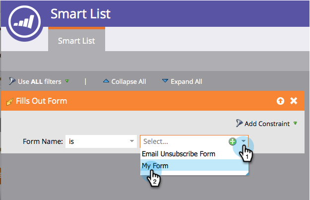

# Campeón/Desafío: Definir criterios de campeón {#champion-challenger-define-champion-criteria}

Una vez configurado el tipo de prueba, debe definir los criterios de campeón. Así es como.

>[!PREREQUISITES]
>
>[Añadir un campeón/Challenger de correo electrónico](/help/marketo/product-docs/email-marketing/general/functions-in-the-editor/email-tests-champion-challenger/add-an-email-champion-challenger.md)

## Criterios estándar de campeón {#standard-champion-criteria}

1. Elija una de las disponibles **Criterios de campeón**.

   

   >[!NOTE]
   >
   >Rastrearemos esta métrica y le enviaremos un informe con los datos por correo electrónico.

1. Si ha elegido uno de los valores predeterminados **Criterios de campeón**, continúe y continúe con [Campeón/Desafío: Configurar alertas de informes](/help/marketo/product-docs/email-marketing/general/functions-in-the-editor/email-tests-champion-challenger/champion-challenger-configure-report-alerts.md)!

## Criterios de campeón personalizados {#custom-champion-criteria}

1. Si quieres ponerte a la moda, puedes ir a la personalización seleccionando **Conversión personalizada** y haga clic en **Editar**.

   

   >[!NOTE]
   >
   >Esto le permite establecer cualquier evento como conversión mediante déclencheur y filtros.

1. Aparecerá una ventana: busque el déclencheur que elija y arrástrelo al lienzo.

   

1. Defina el déclencheur.

   

   Marketo solo permite déclencheur para las personas a las que se ha enviado el correo electrónico desde este programa de correo electrónico. No es necesario añadir el filtro &quot;Se envió correo electrónico&quot;.

1. Haga clic en **Cerrar**.

   

   ¡Excelente! Ahora es el momento de programar el informe.

   >[!MORELIKETHIS]
   >
   >[Campeón/Desafío: Configurar alertas de informes](/help/marketo/product-docs/email-marketing/general/functions-in-the-editor/email-tests-champion-challenger/champion-challenger-configure-report-alerts.md)
