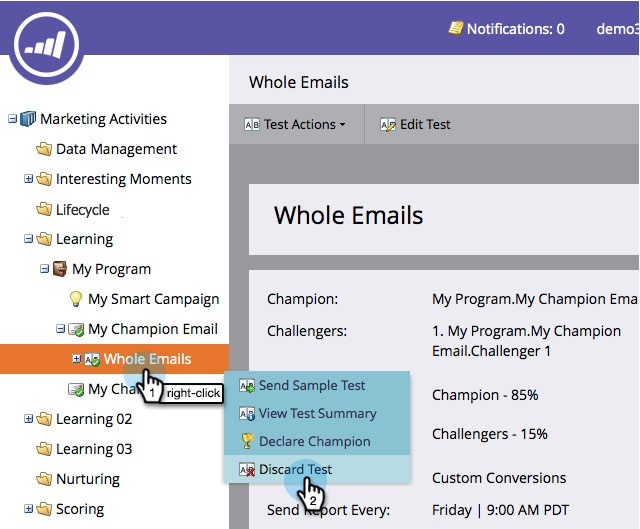

# Campeón/Desafío: Descartar una prueba de correo electrónico {#champion-challenger-discard-an-email-test}

Si, en cualquier momento, decide que no desea continuar ejecutando la prueba de correo electrónico, puede descartarla. Así es como.

>[!PREREQUISITES]
>
>[Campeón/Desafío: Aprobar la prueba de correo electrónico](/help/marketo/product-docs/email-marketing/general/functions-in-the-editor/email-tests-champion-challenger/champion-challenger-approve-your-email-test.md)

1. Vaya a **Actividades de marketing**.

   

1. Busque y haga clic con el botón secundario en la prueba de correo electrónico y, a continuación, haga clic en **Descartar prueba**.

   

1. Haga clic en **Eliminar** para confirmar.

   

   ¡Ya has terminado! Si alguna vez decide que desea configurar una prueba de nuevo, siga adelante y [añadir un campeón/aspirante de correo electrónico](/help/marketo/product-docs/email-marketing/general/functions-in-the-editor/email-tests-champion-challenger/add-an-email-champion-challenger.md).
