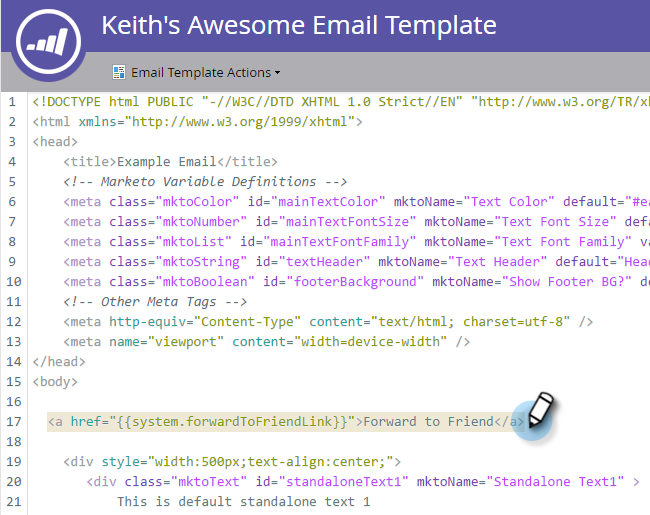
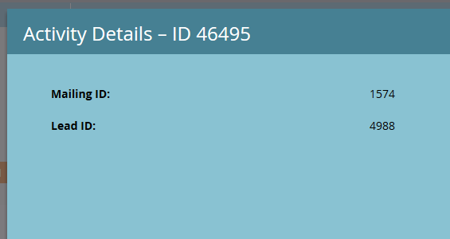

# Enviar a un vínculo de amigo en correos electrónicos {#forward-to-a-friend-link-in-emails}

Añadir el vínculo &quot;Avanzar a amigo&quot; a sus correos electrónicos le permite rastrear a las personas que han recibido un correo electrónico reenviado a través de este vínculo y automáticamente lo agrega como una persona nueva si no están ya en la base de datos.

Por ejemplo, supongamos que Keith utiliza el vínculo &quot;Avanzar a amigo&quot; para reenviar el correo electrónico a una persona desconocida, Mark. Mark se agrega automáticamente como una persona nueva, se le asigna su propia cookie y cualquiera de sus correos electrónicos y actividades web se le vincula. Sin embargo, si Keith utiliza el botón de reenvío en su cliente de correo electrónico, Mark recibe una cookie incorrecta como Keith y su actividad se registra como Keith.

## Añadir el vínculo a una plantilla de correo electrónico {#add-the-link-to-an-email-template}

1. Vaya a **Design Studio**.

   

1. Busque y seleccione la plantilla de correo electrónico a la que desee agregar el vínculo. Haga clic en **Editar borrador**.

   

1. Pegue el siguiente código HTML donde desee que aparezca el vínculo &#39;Avanzar a amigo&#39; (si necesita ayuda con esta parte, consulte con su desarrollador web):

   `<pre data-theme="Confluence"><a href="{{system.forwardToFriendLink}}">Forward to Friend</a></pre>`

   

   >[!TIP]
   >
   >
   >Puede agregar estilo al vínculo para que parezca más agradable. Por ejemplo:
   >
   >`<a href="{{system.forwardToFriendLink}}" style="font-family:arial, sans-serif; padding:10px; position:absolute; right:0px;">Forward to Friend</a>`

   >[!CAUTION]
   >
   >No se recomienda utilizar el estilo **posición:relativa** en la plantilla de correo electrónico. Puede crear problemas con la posición y la visualización del cuadro &quot;Avanzar a amigo&quot;.

1. Haga clic en **Borrador de Previsualización** para asegurarse de que la plantilla tiene el aspecto deseado.

   

   >[!NOTE]
   >
   >**Recordatorio**
   >
   >Recuerde aprobar el borrador de la plantilla para aplicar los cambios.

   Ahora, todos los correos electrónicos que utilicen esa plantilla tendrán el vínculo &#39;Avanzar a amigo&#39;. Cuando el destinatario de correo electrónico haga clic en él, se dirigirá a una versión web del correo electrónico con el cuadro &quot;Avanzar a un amigo&quot;:
   

## Añadir el vínculo a un correo electrónico individual {#add-the-link-to-an-individual-email}

También puede agregar el vínculo &#39;Avanzar a amigo&#39; directamente a un correo electrónico.

1. Abra el correo electrónico en el que desee incluir el vínculo y haga clic con el doble en el área editable.

   

1. Coloque el cursor donde desee que aparezca el vínculo y haga clic en el botón **Insertar token**.

   

1. Seleccione el token **`{{system.forwardToFriendLink}}`**.

   

   >[!NOTE]
   >
   >Este token es la dirección URL de la versión web del correo electrónico con el cuadro &quot;Avanzar a amigo&quot;.

1. Escriba lo que desea que sea el texto para mostrar del vínculo (por ejemplo, &quot;Avanzar a un amigo&quot;).

   

1. Corte el token **`{{system.forwardToFriendLink}}`** mediante Ctrl+X (Windows) o Cmd+X (Mac). Resalte &quot;Avanzar a un amigo&quot; y haga clic en el botón **Insertar/Editar vínculo**.

   

1. Pegue el token **`{{system.forwardToFriendLink}}`** en el cuadro **URL** mediante Ctrl/Cmd+V y haga clic en** Insertar*.

   

1. Guarde la edición y previsualización del nuevo vínculo.

   

   >[!NOTE]
   >
   >De forma predeterminada, las personas nuevas que se agregan mediante la recepción de un mensaje de correo electrónico de &quot;Reenviar a un amigo&quot; dejan de estar suscritas a los correos electrónicos de marketing.

## Actividad de reenvío de vista {#view-forwarding-activity}

Puede ver quién reenvió y recibió los correos electrónicos en el registro de Actividades de la persona.

1. Vaya a **`Database`**.

   

1. Haga clic con el doble en la persona para la que desee realizar la vista de actividad.

   

1. Vaya a la ficha **Registro de Actividad**. Haga clic con el botón doble **Recibió el correo electrónico de reenvío a amigo** o **Enviado a amigo por correo electrónico** para ver los detalles.

   

   >[!NOTE]
   >
   >**Definición**
   >
   >
   >Para Recibido de reenvío a correo electrónico de amigo, el ID de persona es la persona que reenvió el correo electrónico.
   >
   >
   >Para Enviar a un mensaje de correo electrónico de amigo, el ID de persona es la persona que recibió el correo electrónico.

   

1. Para realizar la vista de una persona por ID, copie y pegue el** ID de persona** al final de la URL (el comienzo de dicha URL dependerá de la instancia de Marketing):

   `<pre data-theme="Confluence">...marketo.com/Database/loadPersonDetail?personId=</pre>`

   >[!NOTE]
   >
   >Haremos que **ID de persona** se pueda hacer clic y se vincule directamente a la persona en un parche próximo.

   

   >[!NOTE]
   >
   >Si el amigo que recibe el envío es una persona desconocida, se crea una nueva persona con &quot;Avanzar a amigo&quot; marcado como **Origen** de la persona.\
   >Si el correo electrónico es un recurso local de un programa, el programa se marca como el **Programa de adquisición** de la persona.

## Activar o filtrar mediante la Actividad de reenvío {#trigger-or-filter-using-forwarding-activity}

Existen seis activadores/filtros que puede utilizar para activar acciones de flujo o para filtrar personas mediante la actividad &quot;De reenvío a amigo&quot; enviada y recibida.

En una lista inteligente de una campaña inteligente, si busca &quot;adelante&quot; encontrará los activadores y filtros disponibles.

## Probar hacia delante a amigo {#test-forward-to-friend}

Para probar &quot;Avanzar a amigo&quot;, envíese un correo electrónico con el vínculo de reenvío. Asegúrese de enviarlo a través del paso de flujo **Enviar correo electrónico**, *no* a través de **Enviar correo electrónico de prueba**.
