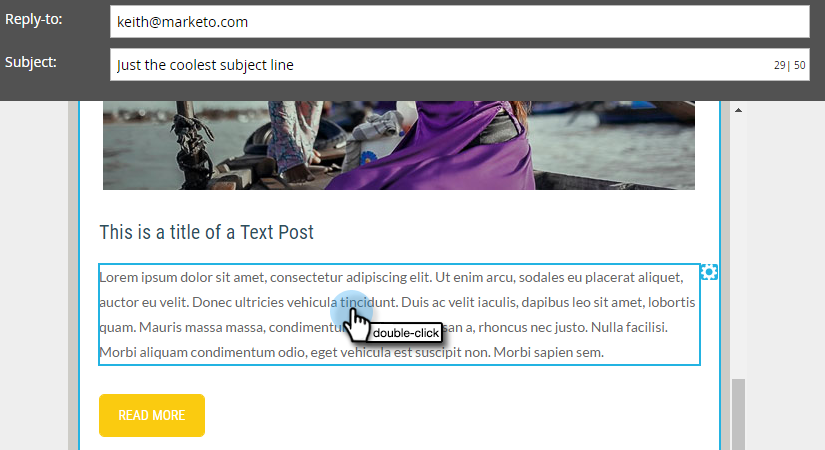
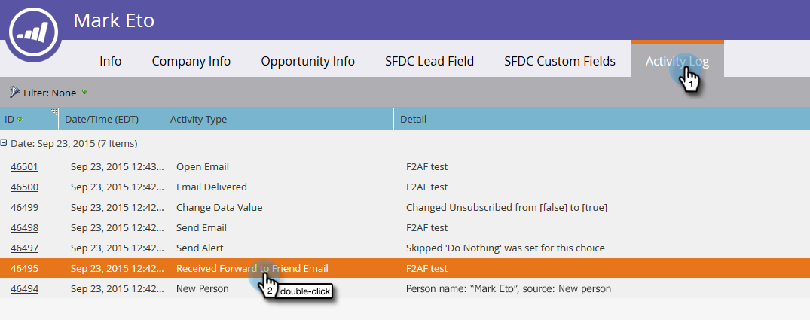

# Reenviar a un amigo Vínculo en correos electrónicos {#forward-to-a-friend-link-in-emails}

Añadir el vínculo &quot;Reenviar a un amigo&quot; a sus correos electrónicos le permite rastrear a las personas que han recibido un correo electrónico reenviado a través de este vínculo y añadirlas automáticamente como una persona nueva si aún no están en la base de datos.

Por ejemplo, supongamos que Keith utiliza el vínculo &quot;Reenviar a un amigo&quot; para reenviar el correo electrónico a una persona desconocida, Mark. Mark se añade automáticamente como una persona nueva, se le asigna su propia cookie y cualquiera de sus actividades de correo electrónico y web se vincula a él. Sin embargo, si Keith utiliza el botón de reenvío en su cliente de correo electrónico, Mark recibe una cookie incorrecta como Keith y su actividad se registra como de Keith.

## Añadir el vínculo a una plantilla de correo electrónico {#add-the-link-to-an-email-template}

1. Vaya a **[!UICONTROL Design Studio]**.

   

1. Busque y seleccione la plantilla de correo electrónico a la que desee añadir el vínculo. Haga clic en **[!UICONTROL Editar borrador]**.

   

1. Pegue el siguiente código HTML donde desee que aparezca el vínculo &#39;Reenviar a amigo&#39; (si necesita ayuda con esta parte, póngase en contacto con el desarrollador web):

   `<a href="{{system.forwardToFriendLink}}">Forward to Friend</a>`

   

   >[!TIP]
   >
   >
   >Puede añadir estilo al vínculo para que tenga un aspecto más agradable. Por ejemplo:
   >
   >`<a href="{{system.forwardToFriendLink}}" style="font-family:arial, sans-serif; padding:10px; position:absolute; right:0px;">Forward to Friend</a>`

   >[!CAUTION]
   >
   >No se recomienda usar el estilo **position:relative** en la plantilla de correo electrónico. Puede crear problemas con la posición y la visualización del cuadro &quot;Reenviar a amigo&quot;.

1. Haga clic en **[!UICONTROL Vista previa del borrador]** para asegurarse de que la plantilla tiene el aspecto que desea.

   

   >[!NOTE]
   >
   >Recuerde aprobar el borrador de la plantilla para aplicar los cambios.

   Ahora, todos los correos electrónicos que utilicen esa plantilla tendrán el vínculo &#39;Reenviar a amigo&#39;. Cuando el destinatario del correo electrónico hace clic en él, se le redirige a una versión web del correo electrónico con el cuadro &quot;Reenviar a un amigo&quot;:

   

## Añadir el vínculo a un correo electrónico individual {#add-the-link-to-an-individual-email}

También puede añadir el vínculo &#39;Reenviar a un amigo&#39; directamente en un correo electrónico.

1. Abra el correo electrónico en el que desea incluir el vínculo y haga doble clic en el área editable.

   

1. Coloque el cursor donde desee que aparezca el vínculo y haga clic en el botón **Insertar token**.

   

1. Seleccione el token **`{{system.forwardToFriendLink}}`**.

   

   >[!NOTE]
   >
   >Este token es la URL de la versión web del correo electrónico con el cuadro &quot;Reenviar a amigo&quot;.

1. Escriba lo que desea que sea el texto que se muestra en el vínculo (por ejemplo, &quot;Reenviar a un amigo&quot;).

   

1. Corte el token **`{{system.forwardToFriendLink}}`** mediante Ctrl+X (Windows) o Cmd+X (Mac). Resalte &quot;Reenviar a un amigo&quot; y haga clic en el botón **Insertar/Editar vínculo**.

   

1. Pegue el token **`{{system.forwardToFriendLink}}`** en el cuadro **URL** mediante Ctrl/Cmd+V y, a continuación, haga clic en **[!UICONTROL Insertar]**.

   

1. Guarde la edición y previsualice el nuevo vínculo.

   

   >[!NOTE]
   >
   >Las nuevas personas que se añaden al recibir un correo electrónico &quot;Reenviar a un amigo&quot; cancelan la suscripción a los correos electrónicos de marketing de forma predeterminada.

## Ver actividad de reenvío {#view-forwarding-activity}

Puede ver quién reenvió y recibió los correos electrónicos en el registro de actividad de la persona.

1. Ir a **[!UICONTROL Base de datos]**.

   

1. Haga doble clic en la persona para la que desee ver la actividad.

   

1. Vaya a la ficha **[!UICONTROL Registro de actividades]**. Haga doble clic en **[!UICONTROL Correo electrónico recibido reenviado a un amigo]** o **[!UICONTROL Correo electrónico enviado a un amigo]** para ver los detalles.

   

   >[!NOTE]
   >
   >**Definición**
   >
   >En el caso del reenvío de correo electrónico recibido a un amigo, el ID de persona es la persona que reenvió el correo electrónico.
   >
   >En el caso de Enviar reenvío a un correo electrónico de un amigo, el ID de persona es la persona que recibió el correo electrónico.

   

1. Para ver una persona por identificador, copie y pegue el **ID de persona** al final de la dirección URL (el principio de la dirección URL dependerá de la instancia de Marketo):

   `...marketo.com/Database/loadPersonDetail?personId=`

   >[!NOTE]
   >
   >Haremos que **[!UICONTROL ID de persona]** se pueda hacer clic en y vincularemos directamente a la persona en un parche próximo.

   

   >[!NOTE]
   >
   >Si el amigo que recibe el reenvío es una persona desconocida, se crea una nueva persona con &quot;Reenviar a amigo&quot; marcado como **Source** de la persona.
   >Si el correo electrónico es un activo local de un programa, el programa se marca como el **Programa de adquisición** de la persona.

## Déclencheur o filtro con actividad de reenvío {#trigger-or-filter-using-forwarding-activity}

Hay seis déclencheur que puede utilizar para almacenar en déclencheur las acciones de flujo o filtrar a las personas por la actividad &quot;Reenviar a amigo&quot; enviada y recibida.

En la lista inteligente de una campaña inteligente, si busca &quot;hacia adelante&quot;, encontrará los déclencheur y filtros disponibles.

## Probar reenvío a amigo {#test-forward-to-friend}

Para probar &quot;Reenviar a un amigo&quot;, envíese un correo electrónico con el vínculo de reenvío. Asegúrese de enviarlo a través del paso de flujo **Enviar correo electrónico**, *no* a través de **Enviar correo electrónico de prueba**.
