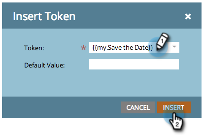

# Incluir un evento de calendario (.ics) en un correo electrónico {#include-a-calendar-event-ics-in-an-email}

Un token de archivo de calendario permite agregar un vínculo de evento de calendario (.ics) a los correos electrónicos de Marketo.

>[!PREREQUISITES]
>
>[Crear un archivo de eventos de calendario (.ics)](/help/marketo/product-docs/email-marketing/general/functions-in-the-editor/create-a-calendar-event-ics-file.md)

1. Mientras editas el correo electrónico del programa, haz clic donde quieras que vaya el token y luego haz clic en el botón **Insertar token**.

1. Seleccione el token del archivo de calendario y haga clic en **[!UICONTROL Insertar]**.

   

1. Haga clic en **[!UICONTROL Guardar]**.

   

   Los destinatarios recibirán un correo electrónico similar a este.

   

¡Misión cumplida!
