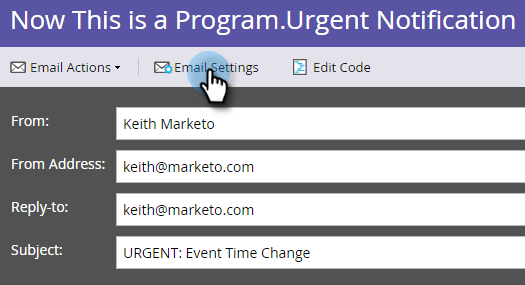

# Hacer que el correo electrónico sea operativo {#make-an-email-operational}

Los mensajes de correo electrónico operativos ignoran los estados de baja de suscripción y de suspendido de marketing. Ellos envían lo que sea.

>[!NOTE]
>
>Los correos electrónicos operativos no están sujetos a límites de comunicación.

1. Busque su correo electrónico, selecciónelo y haga clic en **Editar borrador**.

>[!NOTE]
>
>Solo debe utilizar correos electrónicos operativos para correos electrónicos críticos y respuestas automáticas. No están pensados para correos electrónicos de marketing.

1. Una vez abierto el editor, haga clic en **Configuración de correo electrónico**.

   

1. Marque **Correo electrónico operativo** y haga clic en **Guardar**.

   

>[!CAUTION]
>
>Los correos electrónicos operativos no estaban diseñados para funcionar con programas de participación. Por lo tanto, un programa de participación ignorará el estado operativo de un correo electrónico. Por favor, tenga eso en cuenta cuando trabaje con ellos.

No olvide aprobar este correo electrónico para que los cambios surtan efecto. Obtenga información sobre cómo  [aprobar un correo electrónico](/help/marketo/product-docs/email-marketing/general/creating-an-email/approve-an-email.md).
