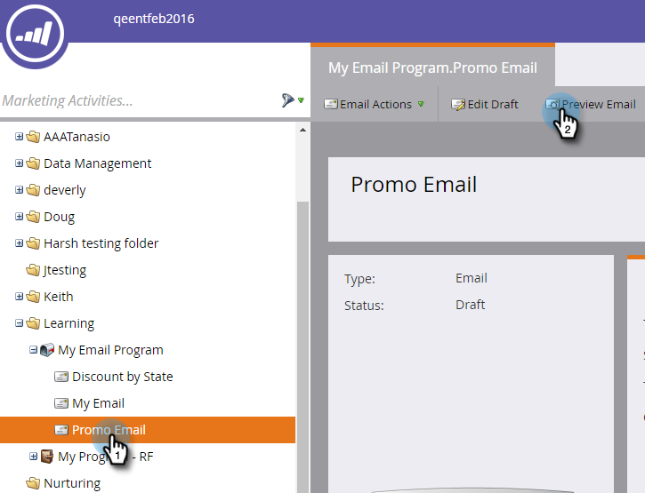

# Vista previa de un correo electrónico con contenido dinámico {#preview-an-email-with-dynamic-content}

Previsualice el correo electrónico después de añadir contenido dinámico para verificarlo.

1. Seleccione su correo electrónico y haga clic en **[!UICONTROL Previsualizar correo electrónico]**.

   

1. Haga clic en el menú desplegable **[!UICONTROL Ver por]** y seleccione el tipo de contenido dinámico que desea previsualizar.

   

1. Aparece una nueva lista desplegable. Haga clic en él y seleccione el contenido específico.

   

1. Utilice las flechas para desplazarse por las opciones.

   

También puede previsualizar el contenido dinámico directamente en el editor de correo electrónico.

1. En **[!UICONTROL Contenido]**, haga clic en la ficha **[!UICONTROL Dinámico]**.

   

1. Haga clic en el contenido que desee previsualizar.

   

¡Excelente! Previsualice los correos electrónicos para asegurarse de que el contenido es del modo deseado.
