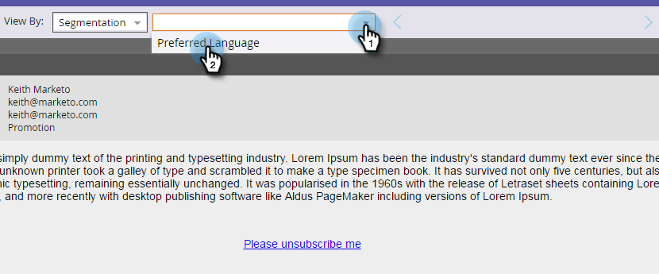

# Previsualización de un correo electrónico con contenido dinámico {#preview-an-email-with-dynamic-content}

Previsualización el correo electrónico después de agregar contenido dinámico para verificarlo.

1. Seleccione el correo electrónico y haga clic en Correo electrónico **de Previsualización**.

   

   Haga clic en la lista desplegable Vista por y seleccione el tipo de contenido dinámico que desea previsualización.
   

1. Aparece una nueva lista desplegable. Haga clic en él y elija el contenido específico.

   

1. Utilice las flechas para desplazarse por las opciones.

   

También puede previsualización de contenido dinámico directamente en el editor de correo electrónico.

1. En **Contenido**, haga clic en la ficha **Dinámico** .

   

1. Haga clic en el contenido que desee previsualización.

   

¡bueno! Previsualización los correos electrónicos para asegurarse de que el contenido es el que desea.
