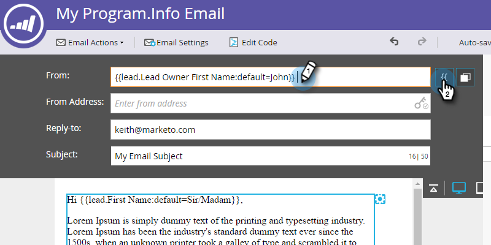

# Enviar correos electrónicos del propietario del posible cliente {#send-emails-from-the-lead-owner}

¿Qué sucede si desea enviar un correo electrónico a un posible cliente en nombre del propietario del posible cliente?  Así es como.

1. Busque su correo electrónico, selecciónelo y haga clic en **Editar borrador**.

   

1. Haga clic en el **De** (elimine cualquier nombre existente) y haga clic en el botón **Insertar token** botón.

   

1. Comience a escribir &quot;`{{lead.Lead Owner`&quot; y seleccione **`{{lead.Lead Owner First Name}}`** token.

   

1. Introduzca un valor predeterminado en caso de que el posible cliente aún no tenga un propietario de posible cliente y haga clic en **Insertar**.

   

1. Haga clic después del primer token, añada un espacio y, a continuación, haga clic en el botón **Insertar token** botón.

   

1. Comience a escribir &quot;`{{lead.Lead Owner`&quot; y seleccione **`{{lead.Lead Owner Last Name}}`** token.

   

1. Introduzca un valor predeterminado en caso de que el posible cliente aún no tenga un propietario de posible cliente y haga clic en **Insertar**.

   

   >[!TIP]
   >
   >Asegúrese de que ha añadido un espacio entre los tokens de nombre y apellido.

1. Haga clic en el campo De correo electrónico (elimine cualquier dirección de correo electrónico existente) y haga clic en el botón Insertar token .

   

1. Comience a escribir &quot;`{{lead.Lead Owner`&quot; y seleccione **`{{lead.Lead Owner Email Address}}`** token.

   

1. Introduzca un valor predeterminado en caso de que el posible cliente aún no tenga un propietario de posible cliente y haga clic en **Insertar**.

   

1. Asegúrese de que la variable **Responder** y **Asunto** los campos están rellenados, ¡y ya ha terminado!

   
