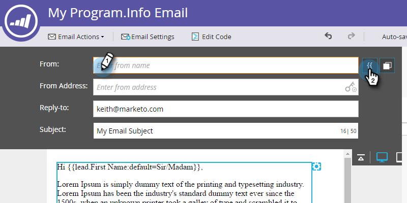
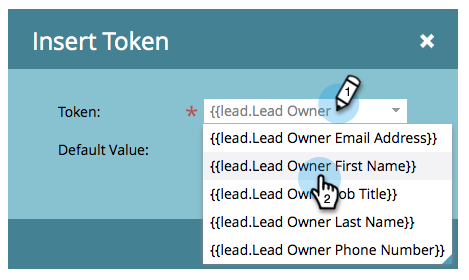
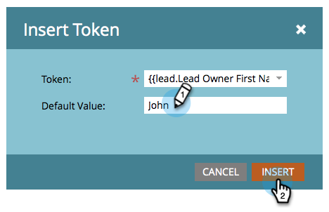
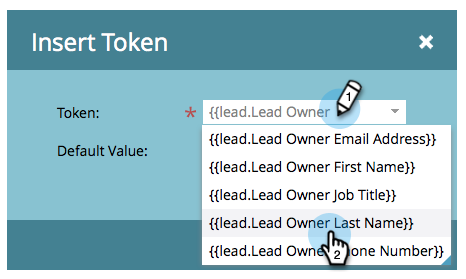
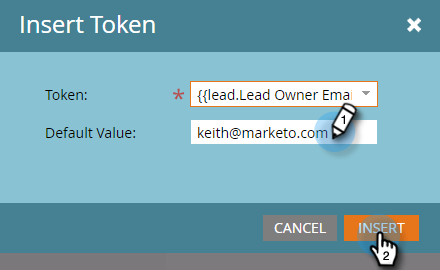

# Envío de correos electrónicos del propietario del posible cliente {#send-emails-from-the-lead-owner}

¿Qué sucede si desea enviar un correo electrónico a un posible cliente en nombre del propietario?  Así es cómo se hace.

1. Busque el correo electrónico, selecciónelo y haga clic en **[!UICONTROL Editar borrador]**.

   

1. Haga clic en el campo **[!UICONTROL De]** (elimine cualquier nombre existente) y luego haga clic en el botón **Insertar token**.

   

1. Empiece a escribir &quot;`{{lead.Lead Owner`&quot; y seleccione el token **`{{lead.Lead Owner First Name}}`**.

   

1. Introduzca un valor predeterminado en el caso de que el posible cliente aún no tenga un propietario y haga clic en **[!UICONTROL Insertar]**.

   

1. Haga clic después del primer token, agregue un espacio y, a continuación, haga clic en el botón **Insertar token**.

   

1. Empiece a escribir &quot;`{{lead.Lead Owner`&quot; y seleccione el token **`{{lead.Lead Owner Last Name}}`**.

   

1. Introduzca un valor predeterminado en el caso de que el posible cliente aún no tenga un propietario y haga clic en **[!UICONTROL Insertar]**.

   

   >[!TIP]
   >
   >Asegúrese de haber agregado un espacio entre los tokens de nombre y apellido.

1. Haga clic en el campo **[!UICONTROL Dirección desde]** (elimine cualquier dirección de correo electrónico existente) y luego haga clic en el botón **Insertar token**.

   

1. Empiece a escribir &quot;`{{lead.Lead Owner`&quot; y seleccione el token **`{{lead.Lead Owner Email Address}}`**.

   

1. Introduzca un valor predeterminado en el caso de que el posible cliente aún no tenga un propietario y haga clic en **[!UICONTROL Insertar]**.

   

1. Asegúrese de que los campos **[!UICONTROL Responder a]** y **[!UICONTROL Asunto]** estén rellenados y que ha finalizado.

   
