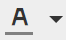
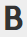
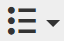
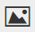
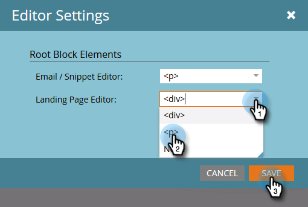

# Uso del editor de texto enriquecido {#using-the-rich-text-editor}

El Editor de texto enriquecido (RTE) aparece en Marketo y está disponible siempre que desee agregar o editar contenido. Verá una versión en páginas de aterrizaje, programas, correos electrónicos, formularios y fragmentos de código. Simplemente haz clic en **[!UICONTROL Editar borrador]** y aparecerá para servirte.

## Configuración de editor {#editor-settings}

La configuración del elemento de bloque raíz define qué etiquetas ajustan el contenido. De manera predeterminada, el elemento de bloque raíz del correo electrónico utiliza etiquetas `
`. Tiene la opción de cambiar esto siguiendo los pasos a continuación.

>[!TIP]
>
>Aunque tiene la opción de elegir el elemento de bloque raíz, siempre recomendamos utilizar la configuración predeterminada para mejorar la experiencia del usuario.

1. Haga clic en **[!UICONTROL Administrador]**.

   

1. Haga clic en **[!UICONTROL Correo electrónico]**.

   

1. Haga clic en **[!UICONTROL Editar configuración del editor de texto]**.

   

1. En el menú desplegable **[!UICONTROL Correo electrónico] / [!UICONTROL Editor de fragmentos]**, seleccione `
` o [!UICONTROL Ninguno] y haga clic en **[!UICONTROL Guardar]**. `
` se usa en este ejemplo.

   

   Si tiene `

` en una plantilla de correo electrónico, verá el siguiente comportamiento de HTML Source al abrir la sección y escribir &quot;El texto va aquí&quot; en el editor:

<table>
 <tbody>
  <tr>
   <th>&lt;p&gt;</th>
   <th>&lt;div&gt;</th>
   <th>Ninguna</th>
  </tr>
  <tr>
   <td>
&lt;div class="mktEditable"&gt; &lt;p&gt;El texto está aquí&lt;/p&gt; &lt;/div&gt;
</td>
   <td>
&lt;div class="mktEditable"&gt; &lt;div&gt;El texto está aquí&lt;/div&gt; &lt;/div&gt;
</td>
   <td>
&lt;div class="mktEditable"&gt; El texto va aquí &lt;/div&gt;
</td>
  </tr>
 </tbody>
</table>

>[!TIP]
>
>También puede cambiar el elemento de bloque raíz del Editor de la página de aterrizaje si sigue los mismos pasos, pero hace clic en la lista desplegable **[!UICONTROL Editor de página de aterrizaje]** en el paso 4 en lugar de [!UICONTROL Correo electrónico] / [!UICONTROL Editor de fragmentos].

>[!NOTE]
>
>El elemento de bloque raíz siempre es `
` para tokens de programa de texto enriquecido.

## Funciones {#features}

Estas son las funciones que encontrará en un RTE.

| Ícono | Nombre | Qué hace |
|---|---|---|
|  | [!UICONTROL Familia de fuentes] | Elige tu estilo, ¡tenemos mucho! |
|  | [!UICONTROL Tamaño de fuente] | ¿Qué tan grande lo quieres? 25 opciones, de 8 px a 90 px. |
|  | [!UICONTROL Estilos] | Elija Párrafo o seis estilos de encabezado (para páginas de aterrizaje). |
|  | [!UICONTROL Interlineado] | Elige la distancia entre las líneas. |
|  | [!UICONTROL Color de texto] | Negro, rojo o lo que quieras. |
|  | [!UICONTROL Color de fondo] | Resaltar para dar énfasis. |
|  | [!UICONTROL Negrita] | **Más oscuro y grueso**. |
|  | [!UICONTROL Cursiva] | *En ángulo, para énfasis o presupuesto* s. |
|  | [!UICONTROL Subrayado] | Pone una línea debajo del texto. |
|  | [!UICONTROL Alineación] | Utilice este menú desplegable para diseñar el texto y las imágenes. Centrarlos, elegir la alineación a la izquierda o a la derecha, o extenderlos de borde a borde con justificación completa. |  |  | Lista | Elija viñetas o números en la lista desplegable. Las viñetas son buenas con las listas y los números con pasos. |
|  | [!UICONTROL Sangría] | Elija más o menos sangría. Utilícelo para párrafos o cualquier texto que desee destacar. |
|  | [!UICONTROL Insertar/Editar vínculo] | Coloque un vínculo a un sitio web u otro contenido; realice fácilmente cambios en él. |
|  | [!UICONTROL Insertar/Editar imagen] | Una imagen vale más que mil palabras. Coloca uno. Haga clic en el icono de la cámara para explorar Design Studio. Puede colocar imágenes en paralelo. |
|  | [!UICONTROL Insertar token] | Una herramienta potente, ideal para la personalización del correo electrónico y el seguimiento de datos. Asegúrese de introducir un valor predeterminado. |
|  | [!UICONTROL Deshacer] | ¡Uy! Vamos a retroceder un paso y volver a intentarlo. |
|  | [!UICONTROL Rehacer] | Si realmente funciona correctamente, vuelva al original. |
|  | [!UICONTROL Tabla] | Construye tu propio, como éste. Un menú desplegable le permite configurarlo. |
|  | [!UICONTROL Insertar anclaje] | ¡Suelta el ancla! |
|  | [!UICONTROL Línea horizontal] | Muchos usos: ideal para dividir secciones. |
|  | [!UICONTROL Editar HTML] | Abre el Editor de Source de HTML para que puedas modificar tu código. |
|  | [!UICONTROL Subíndice] | Letras de cuelgue bajo (como en O`2`). |
|  | [!UICONTROL Superíndice] | ¡Tienes el poder! (2`6`). |
|  | [!UICONTROL Tachado] | `<s>Put a line through text, like this</s>`. |
|  | [!UICONTROL Carácter especial] | ¿Quieres hablar de euros? ¿Matemáticas? Tienes 243 opciones. |
|  | [!UICONTROL Buscar y reemplazar] | Busque y cambie cosas mucho más rápido que buscando cada instancia usted mismo. |
|  | [!UICONTROL Borrar formato] | Devuelva las cosas al estándar. |
|  | [!UICONTROL Cancelar] | Presione el botón para decir: &quot;No importa&quot;. |
|  | [!UICONTROL Guardar] | Presione el botón para decir: &quot;OK, me gusta&quot;. |

>[!TIP]
>
>El HTML y el texto se editan en pantallas independientes. Asegúrate de hacer clic en **[!UICONTROL Copiar de HTML]** en la ficha **[!UICONTROL Texto]** y, a continuación, **[!UICONTROL Guardar]** para que el texto coincida con tu HTML.

>[!NOTE]
>
>No está limitado a las fuentes de la lista desplegable. Puede utilizar uno que no aparezca en la lista accediendo al código HTML. Todas las fuentes web son compatibles con Marketo, pero las fuentes web no funcionan de forma universal en todos los clientes de correo electrónico.

## Páginas de destino {#landing-pages}

La configuración del elemento de bloque raíz define qué etiquetas ajustan el contenido. De manera predeterminada, el elemento de bloque raíz de la página de aterrizaje utiliza etiquetas `
`. Tiene la opción de cambiar esto siguiendo los pasos a continuación.

>[!TIP]
>
>Aunque tiene la opción de elegir el elemento de bloque raíz, siempre recomendamos utilizar la configuración predeterminada para mejorar la experiencia del usuario.

1. Haga clic en **[!UICONTROL Administrador]**.

   

1. Haga clic en **[!UICONTROL Correo electrónico]**.

   

1. Haga clic en **[!UICONTROL Editar configuración del editor de texto]**.

   

1. En la lista desplegable **[!UICONTROL Editor de página de aterrizaje]**, seleccione `
` o [!UICONTROL Ninguno] y haga clic en **[!UICONTROL Guardar]**. `
` se usa en este ejemplo.

   

   ¡Y eso es todo!
