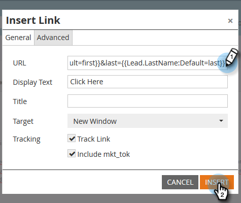

# Añadir tokens a un vínculo de un correo electrónico {#add-tokens-to-an-email-link}

Para insertar parámetros adicionales y específicos de la persona en los vínculos, puede utilizar tokens. Así es cómo se hace.

1. Seleccione su correo electrónico y haga clic en la ficha **[!UICONTROL Editar borrador]**.

   

1. Haga doble clic en un área editable.

   

1. Busque o escriba el texto del vínculo. Resáltelo y haga clic en el icono **[!UICONTROL Insertar/Editar vínculo]**.

   

1. Escriba los tokens deseados en **[!UICONTROL URL]** y haga clic en **[!UICONTROL Insertar]**.

   

1. Haga clic en **[!UICONTROL Guardar]**.

   

>[!MORELIKETHIS]
>
>[Usando direcciones URL en Mis tokens](/help/marketo/product-docs/email-marketing/general/using-tokens/using-urls-in-my-tokens.md)
